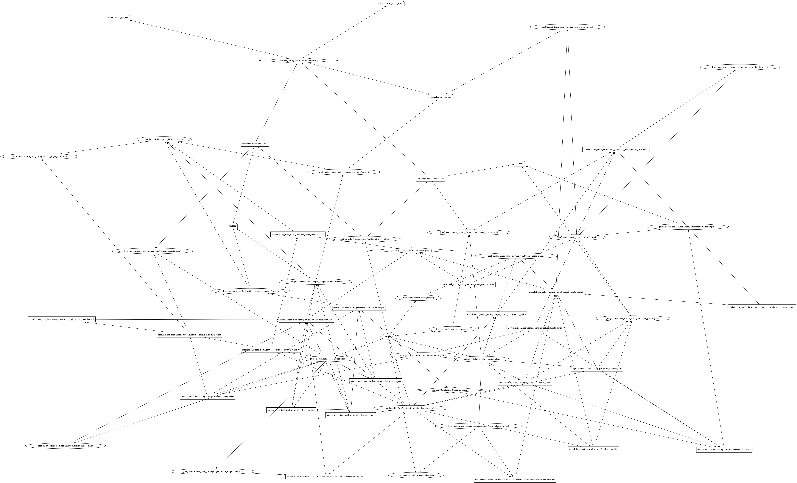

# Terraform Beginner Bootcamp 2023

- [Terraform Beginner Bootcamp 2023](#terraform-beginner-bootcamp-2023)
  - [Terraform graphical representation](#terraform-graphical-representation)
  - [Git](#git)
    - [Fixing Tags](#fixing-tags)
    - [Creating branches in the CLI from a ticket](#creating-branches-in-the-cli-from-a-ticket)

## Terraform graphical representation

How the Terraform module, providers and resourceses are connected in the project.



Picture is generated from running after `terraform init`:
`terraform graph -type=plan`
and returns
```
digraph {
        compound = "true"
        newrank = "true"
        subgraph "root" {
                "[root] module.terrahouse_aws.aws_cloudfront_distribution.s3_distribution (expand)" [label = "module.terrahouse_aws.aws_cloudfront_distribution.s3_distribution", shape = "box"]
                "[root] module.terrahouse_aws.
        ...
```

This can be used in [Graphviz Online](https://dreampuf.github.io/GraphvizOnline) to generate a vizualization of how it all connects.

## Git

Since I have bearly used Git, this is my flow


```sh
# After the work is done and the project is ready to be pushed to Github

# Add all changed files
git add .

# If an issue have been created on Github, use the #<issuenumber> in the comment
# Comment and commit
git commit -m "#26 refactor s3 bucket into the new terrahouse_aws module"

# Upload the changes to Github
git push

# On the Github website, make a pull request (PR) and squash and merge

# After the PR, go back to the terminal

# Change back to main branch
$ git checkout main

# Retrive latest from Github
git pull

# Create the tag
git tag 1.3.0

# Push tag to Github
$ git push --tags

```

### Fixing Tags

Only use if you need to change the tag position.

Start with deleting the local tag
```sh
git tag -d <tag name>
```

Then delete the remote tag
```
git push --delete origin tagname
```

### Creating branches in the CLI from a ticket
```git
git checkout -b 1_semanic_versioning
```
The `-b` creates a new branch.
The `1_semanic_versioning` is the name referring to ticket issue num 1 and ticket description.

To push the new branch use ```git push```
This will give an error

Push again with
```git
git push --set-upstream origin 1_semanitc_versioning
```
