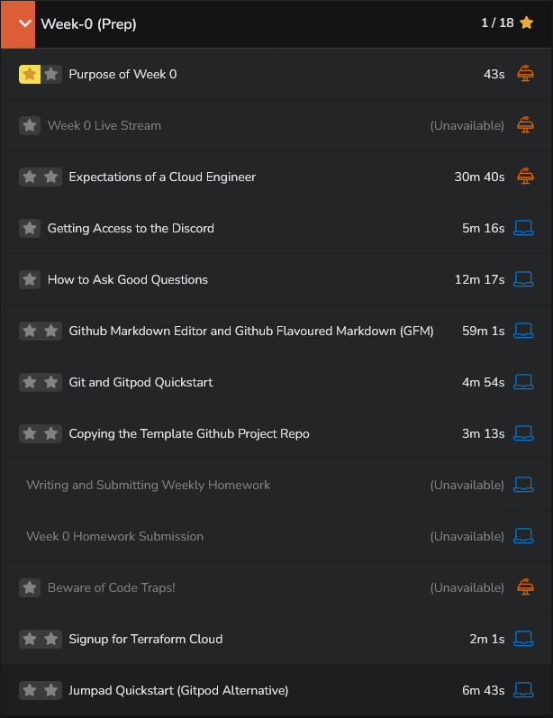

# Summary Week 0 for Terraformers:

**Purpose**: Preparing participants for the upcoming project.

- **Need for Prep Week**: Past boot camps indicated the necessity of a preparation week for boot campers.
- **Collaborative Learning**: Week zero aims to collaboratively address and work through any issues.
- **Setting Up Accounts**: Participants will set up multiple accounts during this period.
- **Discord Access**: Instructions will be provided for those who need access to Discord.
- **Live Stream Focus**: Emphasis will be on the project's details and the architectural diagram.
- **Objective**: Provide a solid business use case and a comprehensive technical overview.
- **End Goal**: By the end of the prep week, participants will be equipped and ready to commence the project.

