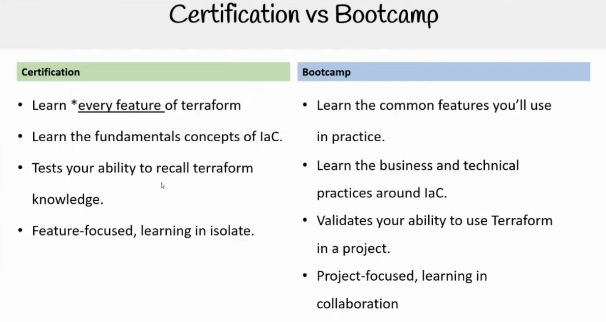

# Livestream

Hashicorp / HUGs meetups

WeCloudData Free Video @youtube

Building the bridge as we cross it
- Not everything is prepared ahead of time
- Project and feature scope may change
- We may need to circle back and repeat things
- we may do things out of order
- we may add content ad-hoc to address unexpected scenarios

This is NOT a paint by numbers bootcamp
- you cannont just follw steps and complete
- you need to use crititcal and best judgement
- you need to look up documentation
- you need to take good notes
- you need to show proof of effort when asking questions
- there are hazards and code traps in this bootcamp

Honing the craft, not just the tool
- we are going to do non-terraform things
- we are going to practice of writing good documentation
- we are going to good git workflow practices
- we are going to write bash scripts
- we are going to explore technical specs
- we are going to google things
- we are going to use assistive LLMs

freecodecamp.org/news/terraform-certified-associate-003-study-notes/

Every Saturday
18.00
Recorded

