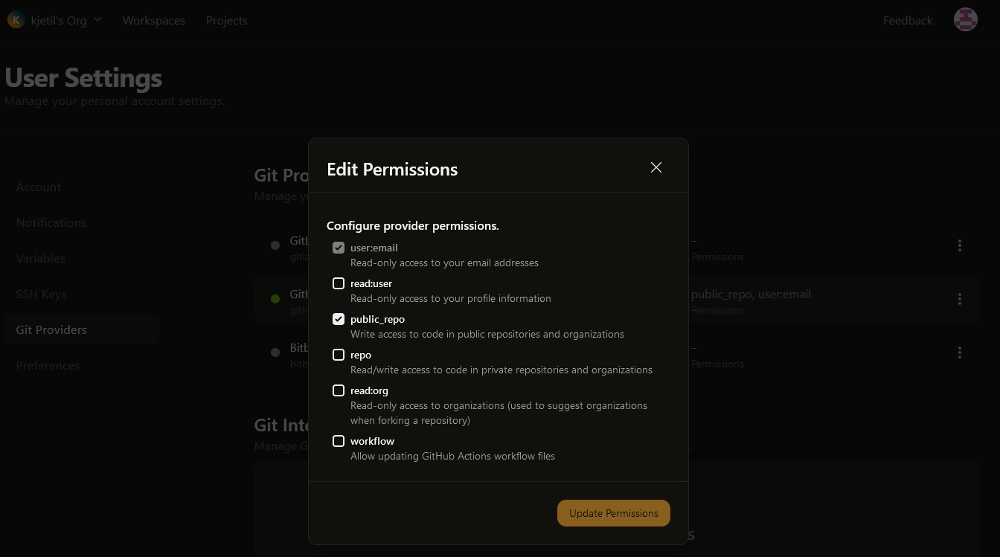
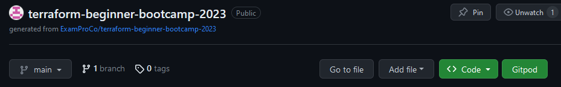
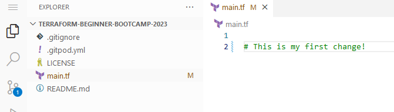

# Setting up Gitpod
1. Referring to a video of setting up Gitpod, no video available in the LMS. Shala posted a link to a video.
   https://www.youtube.com/watch?v=yh9kz9Sh1T8
   Created an account based on that information, linked to my Github account
2. In Git-Pod, add settings for public_repo 
3. Install the Git-Pod browser extension so the button in Github shows up 
4. Open project with the Gitpod button, edit in Gitpod VSC, notice the Git change 
5. Commit with comment describing what was changed
6. Sync Changes
7. Changes will now be in Github 
8. Changes made in Github will be synced to Gitpod, but need to use the git command to sync
   ```sh
   git pull
   ```
9. The Github repository is the "Source of truth"

