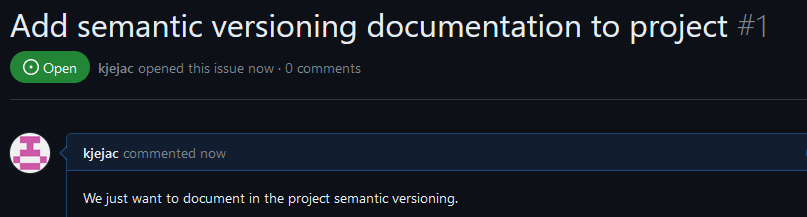
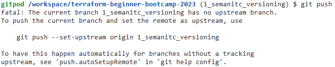
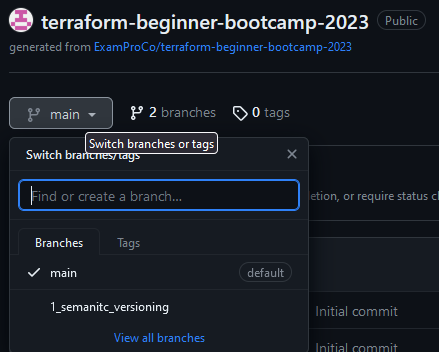
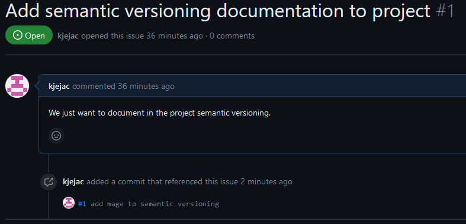
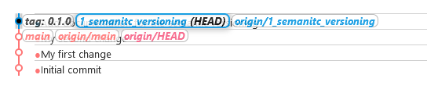
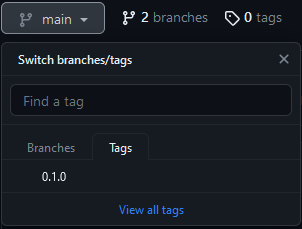
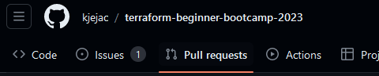

# Branches
The bootcamp will use feature branches.
Create an issue at github.com to get a ticket number



```git
git checkout -b 1_semanic_versioning
```
The ```-b``` creates a new branch.
The ```1_semanic_versioning``` is the name referring to ticket issue num 1 and ticket description.

New branch created


To push the new branch use ```git push```
This will give an error


Push again with
```git
git push --set-upstream origin 1_semanitc_versioning
```

Branch now exist on Github


Added info about semantic versioning in the `README.md` file, commited and pushed to repo.

### Tagging
Tagging usually happens after merging a branch or bring a Pull Request into the main branch.

Remember to include the ticket! `#1 add :mage: to semantic versioning`
(Done separately here, should have be done in the first commit/push) since Github will pick it up and add to the issue 


```git
git tag 0.1.0

# push the tag
git push --tags
```





### Merging branch with main
Make a Pull Request in Github




```git

```

## Semantic Versioning
https://semver.org/
```
MAJOR - 1.0.0
MINOR - 0.1.0
PATCH - 0.0.1
```
MAJOR - make incompatible API changes
MINOR - add functionality with backward compatible manner
PATCH - make backward compatible bug fixes