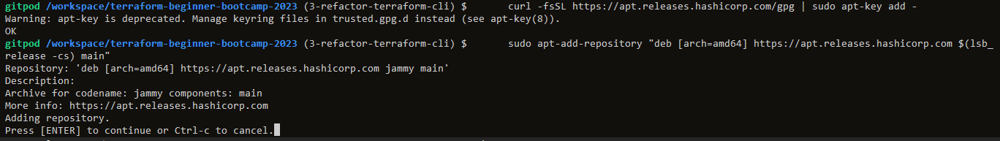
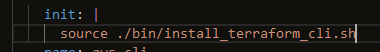
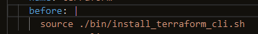

# Terraform CLI Restructure

Should only develop on Linux for the project (WSL on Windows)

How to find what kind of OS and distro Gitpod runs
```bash
# find Linux kernel
uname --kernel-name --kernel-release --machine
# or
uname -srm

# Find distribution
cat /etc/os-release
```

Created new issue for fixing the pause/user interaction for the Terraform CLI, used a label and created a branch.

`.gitpod.yml` file have issues that makes the user hit `Enter` to complete the installation.

To debug, run it line by line - copy the commands in the file to the CLI and run them.

This is the issue


When encountering this kind of problem, the solution often lies in using `-y` so the command is executed smoothly.
```bash
sudo apt-add-repository "deb [arch=amd64] https://apt.releases.hashicorp.com $(lsb_release -cs) main" -y
```

Also there are `deprecating warnings` for the key, so that could be a problem.

Check documentation, in this case on the terraform site. Copy / paste all commands from the site for installing terraform into a file and run line by line.

When copying multiline commands, use `\` - these sometimes does not copy well - remove `\` and make it a single line command and test.

If the commands executes correctly, make it a portable script.
```bash
# From the terraform site
sudo apt-get update && sudo apt-get install -y gnupg software-properties-common curl

wget -O- https://apt.releases.hashicorp.com/gpg | \
gpg --dearmor | \
sudo tee /usr/share/keyrings/hashicorp-archive-keyring.gpg

gpg --no-default-keyring \
--keyring /usr/share/keyrings/hashicorp-archive-keyring.gpg \
--fingerprint

echo "deb [signed-by=/usr/share/keyrings/hashicorp-archive-keyring.gpg] \
https://apt.releases.hashicorp.com $(lsb_release -cs) main" | \
sudo tee /etc/apt/sources.list.d/hashicorp.list

sudo apt update

sudo apt-get install terraform -y
```
```bash
# Converted to a script. ".sh" extention to the file is not nesecary. Use .sh if

#!/usr/bin/env bash
sudo apt-get update && sudo apt-get install -y gnupg software-properties-common curl

wget -O- https://apt.releases.hashicorp.com/gpg | \
gpg --dearmor | \
sudo tee /usr/share/keyrings/hashicorp-archive-keyring.gpg

gpg --no-default-keyring \
--keyring /usr/share/keyrings/hashicorp-archive-keyring.gpg \
--fingerprint

echo "deb [signed-by=/usr/share/keyrings/hashicorp-archive-keyring.gpg] \
https://apt.releases.hashicorp.com $(lsb_release -cs) main" | \
sudo tee /etc/apt/sources.list.d/hashicorp.list

sudo apt update

sudo apt-get install terraform -y
```

The decision to use a .sh file depends on the specific task at hand and your personal workflow preferences. It's a useful tool, but not always necessary for every situation.
#### Use a .sh file if:
1. **Automation**: If you have a series of shell commands that you want to run together or in a specific order, a .sh file can automate the process.
2. **Repeatability**: If you want to be able to run the same set of commands multiple times, a script (.sh file) can save you from manually typing them out each time.
3. **Complexity**: For complex tasks or multiple commands, putting them in a .sh file can make the process more organized and easier to manage.
4. **Portability**: If you want to share a set of commands with others, a .sh file can be easily distributed and executed.
5. **Environment Setup**: When setting up a development environment, a .sh file can be used to install dependencies, configure settings, and perform other setup tasks.
6. **Cron Jobs**: If you want to schedule tasks to run at specific times using cron jobs, a .sh file can contain the necessary commands.
#### Don't use a .sh file if:
1. **One-time Task**: If you're performing a task that you don't plan to repeat, creating a .sh file might be unnecessary.
2. **Simple Commands**: For very basic, one-off commands, it might be faster and more straightforward to type them directly into the shell.
3. **Interactive Tasks**: If the task requires user input or interaction, it might not be suitable for a .sh file.
4. **Performance-Critical Tasks**: In some cases, executing commands directly in the shell might be faster than running them from a script.
### Considerations:
1. **Shebang Line**: If you decide to use a .sh file, make sure to include a shebang line at the beginning (e.g., `#!/bin/bash`). This tells the system which interpreter to use for the script.
2. **Permissions**: Ensure that the script has executable permissions (e.g., `chmod +x script.sh`) to allow it to be run.
3. **Documentation**: Include comments within the script to explain what each section or command does. This makes it more understandable for both you and others who might use the script.
4. **Testing**: Before relying on a script for critical tasks, test it thoroughly in a safe environment to ensure it works as expected.

Need to insert a [shebang](https://en.wikipedia.org/wiki/Shebang_(Unix)) at the start. There are two ways to do it, both work, last one is most portable for Debian/Ubuntu.
```
#!/bin/bash

#!/usr/bin/env bash
```

To run the script
```bash
source ./bin/install_terraform_cli.sh
# or chmod so the file is executable by setting permission to U+X for the user
ls -la ./bin
-rw-r--r-- 1 gitpod gitpod 580 Sep 19 12:01 install_terraform_cli.sh
#
chmod u+x ./bin/install_terraform_cli.sh
ls -la ./bin
-rwxr--r-- 1 gitpod gitpod 580 Sep 19 12:01 install_terraform_cli.sh

# now the file is executable
./bin/install_terraform_cli.sh
```

Change the `init` to the bash script. **NEED** to use `source`



The `init` part in the `.yml` can be an issue since a previous workspace in Gitpod does not run `init`. It only runs that in new instances. https://www.gitpod.io/docs/configure/workspaces/tasks



Use `before`!
