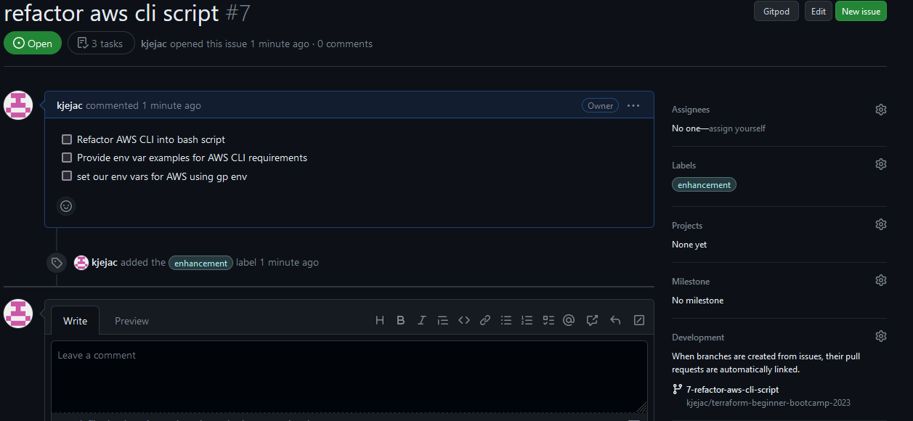
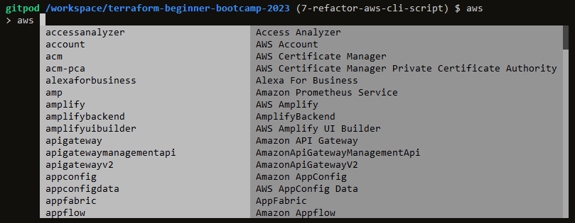
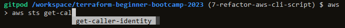
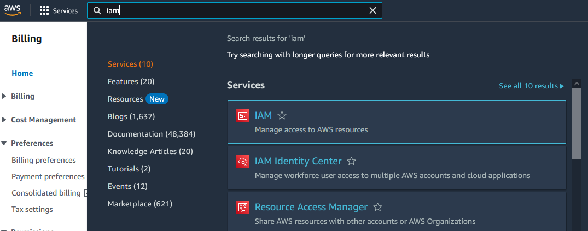
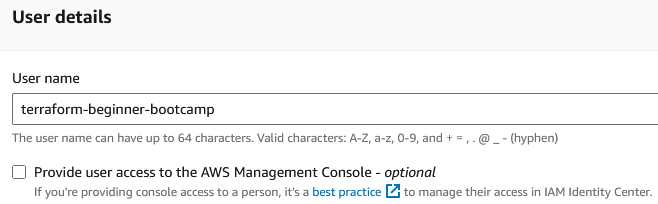
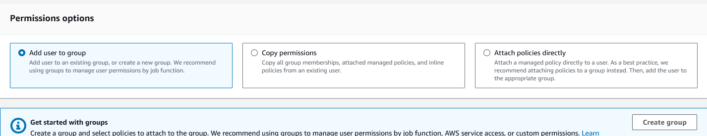
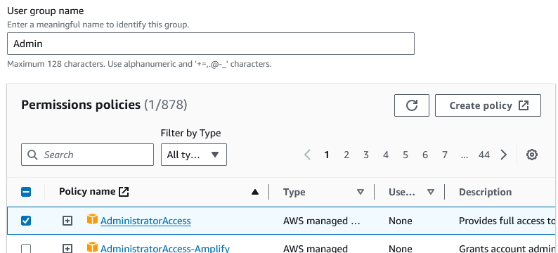
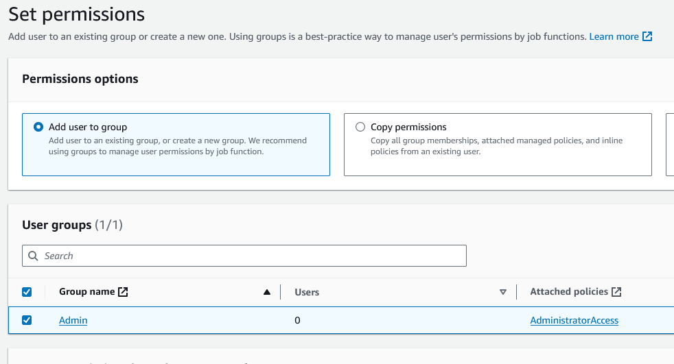
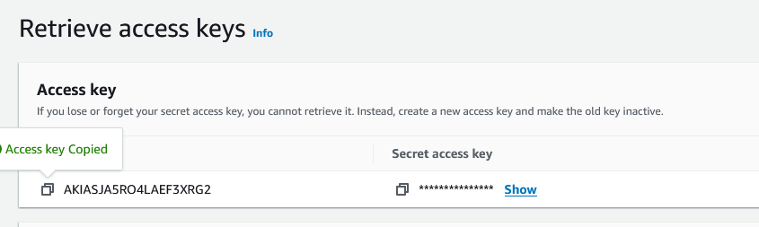

# AWS CLI Refactor

Create a new issue and branch to refactor aws cli script


### Regarding ticket numbers
"When you create a pull request on platforms like GitHub, it's common to associate it with a specific issue in your repository. This is achieved by using keywords like 'closes,' 'fixes,' or 'resolves,' followed by the corresponding issue number in either the pull request description or commit message.

For instance, if you're addressing issue number 123 in your repository, you might include a message like:

```bash
Closes #123
```
GitHub recognizes this syntax and automatically links the pull request to the related issue. Once the pull request is merged, the associated issue is automatically marked as closed.

This convention helps maintain a clear connection between code changes and the specific issues they address. It's particularly valuable in larger projects with numerous contributors."

In Gitpod, create a new file `install_aws_cli` in the `./bin` directory

```sh
#!/usr/bin/env bash

cd /workspace

curl "https://awscli.amazonaws.com/awscli-exe-linux-x86_64.zip" -o "awscliv2.zip"
unzip awscliv2.zip
sudo ./aws/install

cd $PROJECT_ROOT
```

Change the `.gitpod.yml` to use the script-file created.
```yml
tasks:
  - name: terraform
    before: |
      source ./bin/install_terraform_cli.sh
  - name: aws-cli
    env:
# when using the command `aws` in the cli it shows a promt, the line under is causing this
      AWS_CLI_AUTO_PROMPT: on-partial
    before: |
      source ./bin/install_aws_cli
vscode:
  extensions:
    - amazonwebservices.aws-toolkit-vscode
    - hashicorp.terraform
```

When using the command `aws` in the cli it shows a promt
      `AWS_CLI_AUTO_PROMPT: on-partial`


To check that everything works, use `aws sts get-caller-identity` to check if the AWS credential is set. This is done by either typing or start `aws` and then typing the command with the help of autocomplete in the AWS CLI.
```aws
aws
> aws sts get-caller-identity

Unable to locate credentials. You can configure credentials by running "aws configure".
```

This will fail since there are no env vars set!

Never set AWS Env Vars in (script-)files! use `gp env` in Gitpod cloud environment (like a vault)

### AWS credentials
log into [aws.amazon.com](https://aws.amazon.com)

go to `iam`


Create a new user


Add user to a group / create a new group if necessary


**_Example group have global access, but is not necessary! This will be addressed later in the bootcamp._**


**Create unique users, not the same user every time. This gives the option to lock down the permissions for each account.**

To get _Access keys_ for the created user, click on the user and go to _Access Keys_, click on _Crate access key_ and choose _Command Line Interface (CLI_, Confirm and next/create.


**Never commit this info in the pic above, just for local documentation and shouldn't be here either!**

To check if keys are correct:
```sh
export AWS_ACCESS_KEY_ID='___key_id___'
export AWS_SECRET_ACCESS_KEY='____key____'
export AWS_DEFAULT_REGION='eu-north-1'

env | grep AWS_
AWS_DEFAULT_REGION=eu-north-1
AWS_CLI_AUTO_PROMPT=on-partial
AWS_SECRET_ACCESS_KEY=___key___
AWS_ACCESS_KEY_ID=___key_id___
```

If it is correct, set it in Gitpod env vars
```sh
gp env ....
```

To check if everything is OK run the command `aws sts get-caller` - It will return a json payload that looks like this:
```sh
$ aws
> aws sts get-caller-identity
{
    "UserId": "AIDASJA5RO4LIENX4BP4S",
    "Account": "123456789012",
    "Arn": "arn:aws:iam::123456789012:user/terraform-beginner-bootcamp"
}
```
Account number is 12 numbers.

Restart the Gitpod workspace to check that the env vars are set and script is working.

#### Regional endpoints
Most Amazon Web Services offer a Regional endpoint that you can use to make your requests. The general syntax of a Regional endpoint is as follows.

`` `protocol`://`service-code`.`region-code`.amazonaws.com ``

For example, `https://dynamodb.us-west-2.amazonaws.com` is the endpoint for the Amazon DynamoDB service in the US West (Oregon) Region.
[List of all regional endpoints](https://docs.aws.amazon.com/general/latest/gr/rande.html)


Update the README.md file with documentation

