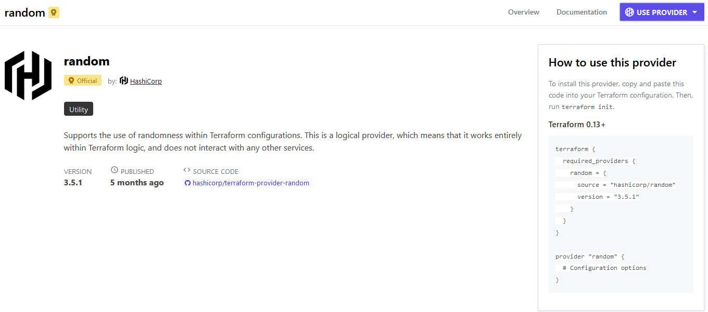

# Random Terraform Provider

Create a new issue and branch
Terraform random bucket name
- [ ] explore the terraform registry
- [ ] install the terraform random provider
- [ ] run terraform init
- [ ] genrerate out a random bucket name
- [ ] output the random bucket name to outputs

### Terraform registry
[Terraform registry](https://registry.terraform.io/) - the place to get providers and modules

**Providers** are a logical abstraction of an upstream API. They are responsible for understanding API interactions and exposing resources. Examples are AWS, Azure, Google Cloud Platform, Kubernetes, Oracle Cloud Infrastructure and Alibaba Cloud.

You will also find documentation here


#### using a provider
Find the provider, copy the code

```hcl
terraform {
  required_providers {
    random = {
      source = "hashicorp/random"
      version = "3.5.1"
    }
  }
}

provider "random" {
  # Configuration options
}
```

Paste the code in a `.tf` file. If pasted into a `main.tf` it is a root level document and is a module.

####
A **module** is a collection of Terraform files that provides commonly used actions as a template. Example:
```json
module "vpc" {
  source = "terraform-aws-modules/vpc/aws"

  name = "my-vpc"
  cidr = "10.0.0.0/16"

  azs             = ["eu-west-1a", "eu-west-1b", "eu-west-1c"]
  private_subnets = ["10.0.1.0/24", "10.0.2.0/24", "10.0.3.0/24"]
  public_subnets  = ["10.0.101.0/24", "10.0.102.0/24", "10.0.103.0/24"]

  enable_nat_gateway = true
  enable_vpn_gateway = true

  tags = {
    Terraform = "true"
    Environment = "dev"
  }
}
```


### Running a Terraform file
Start with
```hcl
$ terraform
Usage: terraform [global options] <subcommand> [args]

The available commands for execution are listed below.
The primary workflow commands are given first, followed by
less common or more advanced commands.

Main commands:
  init          Prepare your working directory for other commands
  validate      Check whether the configuration is valid
  plan          Show changes required by the current configuration
  apply         Create or update infrastructure
  destroy       Destroy previously-created infrastructure

All other commands:
  console       Try Terraform expressions at an interactive command prompt
  fmt           Reformat your configuration in the standard style
  force-unlock  Release a stuck lock on the current workspace
  get           Install or upgrade remote Terraform modules
  graph         Generate a Graphviz graph of the steps in an operation
  import        Associate existing infrastructure with a Terraform resource
  login         Obtain and save credentials for a remote host
  logout        Remove locally-stored credentials for a remote host
  metadata      Metadata related commands
  output        Show output values from your root module
  providers     Show the providers required for this configuration
  refresh       Update the state to match remote systems
  show          Show the current state or a saved plan
  state         Advanced state management
  taint         Mark a resource instance as not fully functional
  test          Experimental support for module integration testing
  untaint       Remove the 'tainted' state from a resource instance
  version       Show the current Terraform version
  workspace     Workspace management

Global options (use these before the subcommand, if any):
  -chdir=DIR    Switch to a different working directory before executing the
                given subcommand.
  -help         Show this help output, or the help for a specified subcommand.
  -version      An alias for the "version" subcommand.

```

Then run `terraform init` to prepare the directory for other commands
```hcl
$ terraform init

Initializing the backend...

Initializing provider plugins...
- Finding hashicorp/random versions matching "3.5.1"...
- Installing hashicorp/random v3.5.1...
- Installed hashicorp/random v3.5.1 (signed by HashiCorp)

Terraform has created a lock file .terraform.lock.hcl to record the provider
selections it made above. Include this file in your version control repository
so that Terraform can guarantee to make the same selections by default when
you run "terraform init" in the future.

Terraform has been successfully initialized!

You may now begin working with Terraform. Try running "terraform plan" to see
any changes that are required for your infrastructure. All Terraform commands
should now work.

If you ever set or change modules or backend configuration for Terraform,
rerun this command to reinitialize your working directory. If you forget, other
commands will detect it and remind you to do so if necessary.
```


_There should now be a `.terraform` directory in the working directory! It contains the provider/binary (written i GO) that was downloaded from the registry._

`.terraform.lock.hcl` contains the locked versioning for the providers or modules that should be used with this project.

The Terraform Lock File should be committed to the Version Control System (VSC) eg. Github.


**Make sure that the `.gitignore` file includes the `.terraform` directory!**


#### terraform plan
Show changes required by the current configuration. This is a change set / plan to execute to see if there is any issues.

```hcl
$ terraform plan

Terraform used the selected providers to generate the following execution plan. Resource actions are indicated with the following symbols:
  + create

Terraform will perform the following actions:

  # random_string.bucket_name will be created
  + resource "random_string" "bucket_name" {
      + id          = (known after apply)
      + length      = 16
      + lower       = true
      + min_lower   = 0
      + min_numeric = 0
      + min_special = 0
      + min_upper   = 0
      + number      = true
      + numeric     = true
      + result      = (known after apply)
      + special     = false
      + upper       = true
    }

Plan: 1 to add, 0 to change, 0 to destroy.

Changes to Outputs:
  + random_bucket_name_id     = (known after apply)
  + random_bucket_name_result = (known after apply)

────────────────────────────────────────────────────────────────────────────────────────────────────────────────────────────────────────────────────────────────────────

Note: You didn't use the -out option to save this plan, so Terraform can't guarantee to take exactly these actions if you run "terraform apply" now.
```

#### terraform apply
Create or update infrastructure based on `terraform plan` first and then execute the plan.

_It will always ask for confirmation unless automated!_

```hcl
$ terraform apply

Terraform used the selected providers to generate the following execution plan. Resource actions are indicated with the following symbols:
  + create

Terraform will perform the following actions:

  # random_string.bucket_name will be created
  + resource "random_string" "bucket_name" {
      + id          = (known after apply)
      + length      = 16
      + lower       = true
      + min_lower   = 0
      + min_numeric = 0
      + min_special = 0
      + min_upper   = 0
      + number      = true
      + numeric     = true
      + result      = (known after apply)
      + special     = false
      + upper       = true
    }

Plan: 1 to add, 0 to change, 0 to destroy.

Changes to Outputs:
  + random_bucket_name_id     = (known after apply)
  + random_bucket_name_result = (known after apply)

Do you want to perform these actions?
  Terraform will perform the actions described above.
  Only 'yes' will be accepted to approve.

  Enter a value: yes

random_string.bucket_name: Creating...
random_string.bucket_name: Creation complete after 0s [id=2QEiCSyzPbbTMpBC]

Apply complete! Resources: 1 added, 0 changed, 0 destroyed.

Outputs:

random_bucket_name_id = "2QEiCSyzPbbTMpBC"
random_bucket_name_result = "2QEiCSyzPbbTMpBC"
```

Changing the `main.tf` requires that we run `terraform plan` again (removed last output)
```hcl
$ terraform plan
random_string.bucket_name: Refreshing state... [id=2QEiCSyzPbbTMpBC]

Changes to Outputs:
  + random_bucket_name        = "2QEiCSyzPbbTMpBC"
  - random_bucket_name_id     = "2QEiCSyzPbbTMpBC" -> null
  - random_bucket_name_result = "2QEiCSyzPbbTMpBC" -> null

You can apply this plan to save these new output values to the Terraform state, without changing any real infrastructure.
```

After the change `terraform apply` needs to run again. This time with the parameter `--auto-approve` to remove the confirmation dialog
```hcl
$ terraform apply --auto-approve
random_string.bucket_name: Refreshing state... [id=2QEiCSyzPbbTMpBC]

Changes to Outputs:
  + random_bucket_name        = "2QEiCSyzPbbTMpBC"
  - random_bucket_name_id     = "2QEiCSyzPbbTMpBC" -> null
  - random_bucket_name_result = "2QEiCSyzPbbTMpBC" -> null

You can apply this plan to save these new output values to the Terraform state, without changing any real infrastructure.

Apply complete! Resources: 0 added, 0 changed, 0 destroyed.

Outputs:

random_bucket_name = "2QEiCSyzPbbTMpBC"
```

To get only the output use `terraform output`
```hcl
$ terraform output
random_bucket_name = "2QEiCSyzPbbTMpBC"

# Can use filter
$ terraform output random_bucket_name
"2QEiCSyzPbbTMpBC"
```

### terraform.tfstate

The `.tfstate` file in Terraform contains the current state of your infrastructure. It keeps track of the resources that have been created, their attributes, and their dependencies. This file is crucial for Terraform to plan and execute changes to your infrastructure. It also serves as a lock to prevent concurrent modifications. Storing it securely and managing it properly is important for effective Terraform usage.

In practice we don't fiddle with this file!