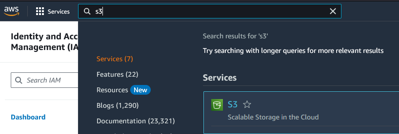
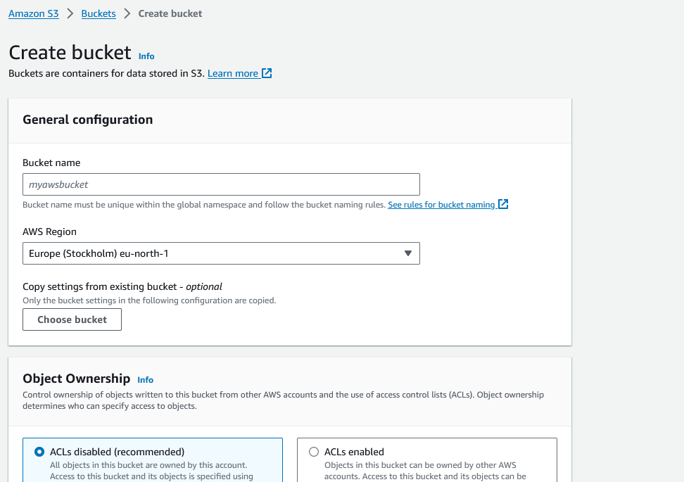
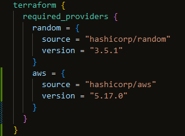
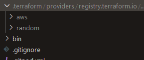
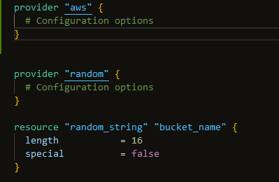
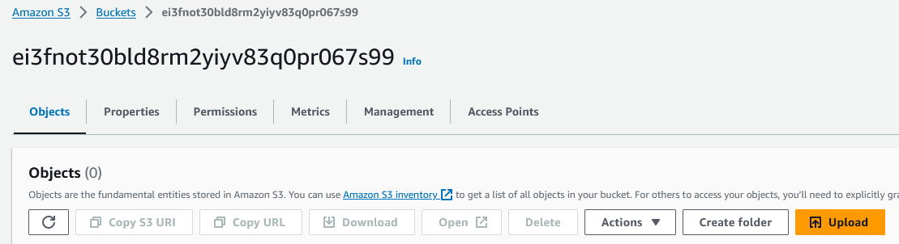
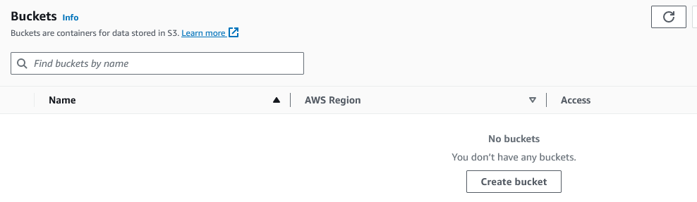

# Terraform Provider S3 Bucket, Terraform Destroy

- [ ] Define an S3 Bucket in Terraform
- [ ] We are going to use the random resource string for the name
- [ ] Install the AWS Terraform Provider
- [ ] Configure AWS Provider

S3 is object storage, think of OneDrive/Dropbox




This can be done in Terraform.

To list S3 Buckets in the terminal use `aws s3 ls`

Bucket must be unique within the global namespace. [Bucket naming rules](https://docs.aws.amazon.com/AmazonS3/latest/userguide/bucketnamingrules.html?icmpid=docs_amazons3_console)

Open `main.tf`

You can only have `terraform` block. This block can contain several `required_providers`


**When adding a provider, run `terraform init ` again. This must be done so the binary can be downloaded.**


To see if naming a bucket works



```sh
$ terraform init

Initializing the backend...

Initializing provider plugins...
- Finding hashicorp/aws versions matching "5.17.0"...
- Reusing previous version of hashicorp/random from the dependency lock file
- Installing hashicorp/aws v5.17.0...
- Installed hashicorp/aws v5.17.0 (signed by HashiCorp)
- Installing hashicorp/random v3.5.1...
- Installed hashicorp/random v3.5.1 (signed by HashiCorp)

Terraform has made some changes to the provider dependency selections recorded
in the .terraform.lock.hcl file. Review those changes and commit them to your
version control system if they represent changes you intended to make.

Terraform has been successfully initialized!

You may now begin working with Terraform. Try running "terraform plan" to see
any changes that are required for your infrastructure. All Terraform commands
should now work.

If you ever set or change modules or backend configuration for Terraform,
rerun this command to reinitialize your working directory. If you forget, other
commands will detect it and remind you to do so if necessary.

$ terraform apply --auto-approve

Terraform used the selected providers to generate the following execution plan. Resource actions are indicated with the following symbols:
  + create

Terraform will perform the following actions:

  # random_string.bucket_name will be created
  + resource "random_string" "bucket_name" {
      + id          = (known after apply)
      + length      = 16
      + lower       = true
      + min_lower   = 0
      + min_numeric = 0
      + min_special = 0
      + min_upper   = 0
      + number      = true
      + numeric     = true
      + result      = (known after apply)
      + special     = false
      + upper       = true
    }

Plan: 1 to add, 0 to change, 0 to destroy.

Changes to Outputs:
  + random_bucket_name = (known after apply)
random_string.bucket_name: Creating...
random_string.bucket_name: Creation complete after 0s [id=2V7ijCvD4Hvt8SMK]

Apply complete! Resources: 1 added, 0 changed, 0 destroyed.

Outputs:

random_bucket_name = "2V7ijCvD4Hvt8SMK"
```
This have generated a name `2V7ijCvD4Hvt8SMK` that is not following the **[naming rules](https://docs.aws.amazon.com/AmazonS3/latest/userguide/bucketnamingrules.html?icmpid=docs_amazons3_console)** for buckets in AWS. It can only consists of lowercase letters, numbers, dots `.` and hyphens `-`.

Running `terraform apply` with the current naming convention from random
```sh
$ terraform apply
random_string.bucket_name: Refreshing state... [id=2V7ijCvD4Hvt8SMK]

Terraform used the selected providers to generate the following execution plan. Resource actions are
indicated with the following symbols:
  + create

Terraform will perform the following actions:

  # aws_s3_bucket.example will be created
  + resource "aws_s3_bucket" "example" {
      + acceleration_status         = (known after apply)
      + acl                         = (known after apply)
      + arn                         = (known after apply)
      + bucket                      = "2V7ijCvD4Hvt8SMK"
      + bucket_domain_name          = (known after apply)
      + bucket_prefix               = (known after apply)
      + bucket_regional_domain_name = (known after apply)
      + force_destroy               = false
      + hosted_zone_id              = (known after apply)
      + id                          = (known after apply)
      + object_lock_enabled         = (known after apply)
      + policy                      = (known after apply)
      + region                      = (known after apply)
      + request_payer               = (known after apply)
      + tags_all                    = (known after apply)
      + website_domain              = (known after apply)
      + website_endpoint            = (known after apply)
    }

Plan: 1 to add, 0 to change, 0 to destroy.

Do you want to perform these actions?
  Terraform will perform the actions described above.
  Only 'yes' will be accepted to approve.

  Enter a value: yes

aws_s3_bucket.example: Creating...
╷
│ Error: validating S3 Bucket (2V7ijCvD4Hvt8SMK) name: only lowercase alphanumeric characters and hyphens allowed in "2V7ijCvD4Hvt8SMK"
│
│   with aws_s3_bucket.example,
│   on main.tf line 28, in resource "aws_s3_bucket" "example":
│   28: resource "aws_s3_bucket" "example" {
│
╵
```

This fails as expected because the name contains uppercase letters.

To solve this the `resource` must be configured.
```json
# https://registry.terraform.io/providers/hashicorp/random/latest/docs/resources/string
resource "random_string" "bucket_name" {
  lower            = true
  upper            = false
  length           = 32
  special          = false
}

# https://registry.terraform.io/providers/hashicorp/aws/latest/docs/resources/s3_bucket
resource "aws_s3_bucket" "example" {
  # Bucket naming rules
  # https://docs.aws.amazon.com/AmazonS3/latest/userguide/bucketnamingrules.html?icmpid=docs_amazons3_console
  bucket = random_string.bucket_name.result
}
```

To check if the new configuration is good
```sh
$ terraform validate
Success! The configuration is valid.
```

Run `terraform plan` (validate is run part of this step)
```sh
$ terraform plan
random_string.bucket_name: Refreshing state... [id=2V7ijCvD4Hvt8SMK]

Terraform used the selected providers to generate the following execution plan. Resource actions are
indicated with the following symbols:
  + create
-/+ destroy and then create replacement

Terraform will perform the following actions:

  # aws_s3_bucket.example will be created
  + resource "aws_s3_bucket" "example" {
      + acceleration_status         = (known after apply)
      + acl                         = (known after apply)
      + arn                         = (known after apply)
      + bucket                      = (known after apply)
      + bucket_domain_name          = (known after apply)
      + bucket_prefix               = (known after apply)
      + bucket_regional_domain_name = (known after apply)
      + force_destroy               = false
      + hosted_zone_id              = (known after apply)
      + id                          = (known after apply)
      + object_lock_enabled         = (known after apply)
      + policy                      = (known after apply)
      + region                      = (known after apply)
      + request_payer               = (known after apply)
      + tags_all                    = (known after apply)
      + website_domain              = (known after apply)
      + website_endpoint            = (known after apply)
    }

  # random_string.bucket_name must be replaced
-/+ resource "random_string" "bucket_name" {
      ~ id          = "2V7ijCvD4Hvt8SMK" -> (known after apply)
      ~ length      = 16 -> 32 # forces replacement
      ~ result      = "2V7ijCvD4Hvt8SMK" -> (known after apply)
      ~ upper       = true -> false # forces replacement
        # (8 unchanged attributes hidden)
    }

Plan: 2 to add, 0 to change, 1 to destroy.

Changes to Outputs:
  ~ random_bucket_name = "2V7ijCvD4Hvt8SMK" -> (known after apply)

────────────────────────────────────────────────────────────────────────────────────────────────────────

Note: You didn't use the -out option to save this plan, so Terraform can't guarantee to take exactly
these actions if you run "terraform apply" now.
```
_Notice that new name is not generated here!_

Run `terraform apply`
```sh
$ terraform apply
random_string.bucket_name: Refreshing state... [id=2V7ijCvD4Hvt8SMK]

Terraform used the selected providers to generate the following execution plan. Resource actions are
indicated with the following symbols:
  + create
-/+ destroy and then create replacement

Terraform will perform the following actions:

  # aws_s3_bucket.example will be created
  + resource "aws_s3_bucket" "example" {
      + acceleration_status         = (known after apply)
      + acl                         = (known after apply)
      + arn                         = (known after apply)
      + bucket                      = (known after apply)
      + bucket_domain_name          = (known after apply)
      + bucket_prefix               = (known after apply)
      + bucket_regional_domain_name = (known after apply)
      + force_destroy               = false
      + hosted_zone_id              = (known after apply)
      + id                          = (known after apply)
      + object_lock_enabled         = (known after apply)
      + policy                      = (known after apply)
      + region                      = (known after apply)
      + request_payer               = (known after apply)
      + tags_all                    = (known after apply)
      + website_domain              = (known after apply)
      + website_endpoint            = (known after apply)
    }

  # random_string.bucket_name must be replaced
-/+ resource "random_string" "bucket_name" {
      ~ id          = "2V7ijCvD4Hvt8SMK" -> (known after apply)
      ~ length      = 16 -> 32 # forces replacement
      ~ result      = "2V7ijCvD4Hvt8SMK" -> (known after apply)
      ~ upper       = true -> false # forces replacement
        # (8 unchanged attributes hidden)
    }

Plan: 2 to add, 0 to change, 1 to destroy.

Changes to Outputs:
  ~ random_bucket_name = "2V7ijCvD4Hvt8SMK" -> (known after apply)

Do you want to perform these actions?
  Terraform will perform the actions described above.
  Only 'yes' will be accepted to approve.

  Enter a value: yes

random_string.bucket_name: Destroying... [id=2V7ijCvD4Hvt8SMK]
random_string.bucket_name: Destruction complete after 0s
random_string.bucket_name: Creating...
random_string.bucket_name: Creation complete after 0s [id=ei3fnot30bld8rm2yiyv83q0pr067s99]
aws_s3_bucket.example: Creating...
aws_s3_bucket.example: Creation complete after 1s [id=ei3fnot30bld8rm2yiyv83q0pr067s99]

Apply complete! Resources: 2 added, 0 changed, 1 destroyed.

Outputs:

random_bucket_name = "ei3fnot30bld8rm2yiyv83q0pr067s99"
```


To remove the bucket use `terraform destroy`
```sh
$ terraform destroy
random_string.bucket_name: Refreshing state... [id=ei3fnot30bld8rm2yiyv83q0pr067s99]
aws_s3_bucket.example: Refreshing state... [id=ei3fnot30bld8rm2yiyv83q0pr067s99]

Terraform used the selected providers to generate the following execution plan. Resource actions are
indicated with the following symbols:
  - destroy

Terraform will perform the following actions:

  # aws_s3_bucket.example will be destroyed
  - resource "aws_s3_bucket" "example" {
      - arn                         = "arn:aws:s3:::ei3fnot30bld8rm2yiyv83q0pr067s99" -> null
      - bucket                      = "ei3fnot30bld8rm2yiyv83q0pr067s99" -> null
      - bucket_domain_name          = "ei3fnot30bld8rm2yiyv83q0pr067s99.s3.amazonaws.com" -> null
      - bucket_regional_domain_name = "ei3fnot30bld8rm2yiyv83q0pr067s99.s3.eu-north-1.amazonaws.com" -> null
      - force_destroy               = false -> null
      - hosted_zone_id              = "Z3BAZG2TWCNX0D" -> null
      - id                          = "ei3fnot30bld8rm2yiyv83q0pr067s99" -> null
      - object_lock_enabled         = false -> null
      - region                      = "eu-north-1" -> null
      - request_payer               = "BucketOwner" -> null
      - tags                        = {} -> null
      - tags_all                    = {} -> null

      - grant {
          - id          = "8ac82ade07cbd8c14a7f153fb920561ba3f19829b41d12ceb830fd26edc909e0" -> null
          - permissions = [
              - "FULL_CONTROL",
            ] -> null
          - type        = "CanonicalUser" -> null
        }

      - server_side_encryption_configuration {
          - rule {
              - bucket_key_enabled = false -> null

              - apply_server_side_encryption_by_default {
                  - sse_algorithm = "AES256" -> null
                }
            }
        }

      - versioning {
          - enabled    = false -> null
          - mfa_delete = false -> null
        }
    }

  # random_string.bucket_name will be destroyed
  - resource "random_string" "bucket_name" {
      - id          = "ei3fnot30bld8rm2yiyv83q0pr067s99" -> null
      - length      = 32 -> null
      - lower       = true -> null
      - min_lower   = 0 -> null
      - min_numeric = 0 -> null
      - min_special = 0 -> null
      - min_upper   = 0 -> null
      - number      = true -> null
      - numeric     = true -> null
      - result      = "ei3fnot30bld8rm2yiyv83q0pr067s99" -> null
      - special     = false -> null
      - upper       = false -> null
    }

Plan: 0 to add, 0 to change, 2 to destroy.

Changes to Outputs:
  - random_bucket_name = "ei3fnot30bld8rm2yiyv83q0pr067s99" -> null

Do you really want to destroy all resources?
  Terraform will destroy all your managed infrastructure, as shown above.
  There is no undo. Only 'yes' will be accepted to confirm.

  Enter a value: yes

aws_s3_bucket.example: Destroying... [id=ei3fnot30bld8rm2yiyv83q0pr067s99]
aws_s3_bucket.example: Destruction complete after 1s
random_string.bucket_name: Destroying... [id=ei3fnot30bld8rm2yiyv83q0pr067s99]
random_string.bucket_name: Destruction complete after 0s

Destroy complete! Resources: 2 destroyed.
```



### Authentication and Configuration
Use the Amazon Web Services (AWS) provider to interact with the many resources supported by AWS. You must configure the provider with the [**proper credentials**](https://registry.terraform.io/providers/hashicorp/aws/latest/docs) before you can use it.

Configuration for the AWS Provider can be derived from several sources, which are applied in the following order
1. Parameters in the provider configuration **<-- DON'T DO THIS**
2. Environment variables **<-- BOOTCAMP METHOD**
3. Shared credentials files
4. Shared configuration files
5. Container credentials
6. Instance profile credentials and region


