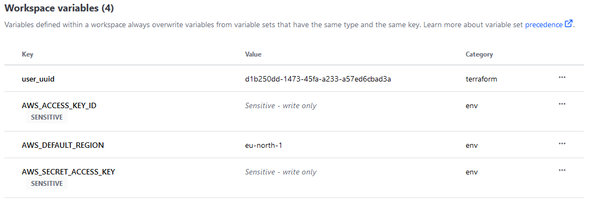

# Update `week1.md`
this is done in the `19-create-toc-readme` branch

## [Root Module Structure](https://github.com/kjejac/terraform-beginner-bootcamp-2023/blob/19-create-toc-readme/journal/week1.md#root-module-structure)

Our root module structure is as follows:

```
- PROJECT_ROOT
  |-- main.tf               - everything else
  |-- variables.tf          - stores the structure of input variables
  |-- terraform.tfvars      - the data of variables we want to load into our terraform project
  |-- providers.tf          - defined required providers and their configuration
  |-- outputs.tf            - stores our outputs
  |-- README.md             - required for root modules
```

[Standard Module Structure](https://developer.hashicorp.com/terraform/language/modules/develop/structure)

# Gitpod

## Create files
Created the files in Gitpod


## Edit files
From the main.tf, move the following content
### `providers.tf`
```json
terraform {
  cloud {
    organization = "kjejac"
    workspaces {
      name = "terra-house-1"
    }
  }
  required_providers {
    random = {
      source = "hashicorp/random"
      version = "3.5.1"
    }
    aws = {
      source = "hashicorp/aws"
      version = "5.17.0"
    }
  }
}


provider "aws" {
  # Configuration options
}


provider "random" {
  # Configuration options
}
```
There are different opinions about the `terraform` block that it should always be in the `main.tf`.

### `outputs.tf`
```json
output "random_bucket_name" {
  value = random_string.bucket_name.result
}
```

### `variables.tf`
This is created and for the video is run in local state
```json
variable "user_uuid" {
    description = "The UUID of the user"
    type = string
    validation {
        condition = can(regex("^[0-9a-fA-F]{8}-[0-9a-fA-F]{4}-[0-9a-fA-F]{4}-[0-9a-fA-F]{4}-[0-9a-fA-F]{12}$", var.user_uuid))
        error_message = "The user_uuid value is not a valid UUID"
    }
}
```
https://developer.hashicorp.com/terraform/language/values/variables

#### `main.tf`
This what the file should contain
```json
# https://registry.terraform.io/providers/hashicorp/random/latest/docs/resources/string
resource "random_string" "bucket_name" {
  lower            = true
  upper            = false
  length           = 32
  special          = false
}

# https://registry.terraform.io/providers/hashicorp/aws/latest/docs/resources/s3_bucket
resource "aws_s3_bucket" "example" {
  # Bucket naming rules
  # https://docs.aws.amazon.com/AmazonS3/latest/userguide/bucketnamingrules.html?icmpid=docs_amazons3_console
  bucket = random_string.bucket_name.result

   tags = {
   UserUuid = var.user_uuid
  }
}
```

#### Running the variable using the `-var` flag
```sh
tf plan -var user_uuid="d1b250dd-1473-45fa-a233-a57ed6cbad3a"

Terraform used the selected providers to generate the following execution plan. Resource actions are indicated with the following symbols:
  + create

Terraform will perform the following actions:

  # aws_s3_bucket.example will be created
  + resource "aws_s3_bucket" "example" {
      + acceleration_status         = (known after apply)
      + acl                         = (known after apply)
      + arn                         = (known after apply)
      + bucket                      = (known after apply)
      + bucket_domain_name          = (known after apply)
      + bucket_prefix               = (known after apply)
      + bucket_regional_domain_name = (known after apply)
      + force_destroy               = false
      + hosted_zone_id              = (known after apply)
      + id                          = (known after apply)
      + object_lock_enabled         = (known after apply)
      + policy                      = (known after apply)
      + region                      = (known after apply)
      + request_payer               = (known after apply)
      + tags                        = {
          + "UserUuid" = "d1b250dd-1473-45fa-a233-a57ed6cbad3a"
        }
      + tags_all                    = {
          + "UserUuid" = "d1b250dd-1473-45fa-a233-a57ed6cbad3a"
        }
      + website_domain              = (known after apply)
      + website_endpoint            = (known after apply)
    }

  # random_string.bucket_name will be created
  + resource "random_string" "bucket_name" {
      + id          = (known after apply)
      + length      = 32
      + lower       = true
      + min_lower   = 0
      + min_numeric = 0
      + min_special = 0
      + min_upper   = 0
      + number      = true
      + numeric     = true
      + result      = (known after apply)
      + special     = false
      + upper       = false
    }

Plan: 2 to add, 0 to change, 0 to destroy.

Changes to Outputs:
  + random_bucket_name = (known after apply)

──────────────────────────────────────────────────────────────────────────────────────────────────────────────────────────────────────────────────────────────

Note: You didn't use the -out option to save this plan, so Terraform can't guarantee to take exactly these actions if you run "terraform apply" now.
```

#### Running the variable using the `terraform.tfvars` file

Insert the variable `user_uuid` into the `terraform.tfvars` file


**`terraform.tfvars` will not be committed - it is in the ignore file**

Create an examplefile of the `terraform.tfvars`, edit the `.gitpod.yml` to copy the `var` from the examplefile to the `terraform.tfvars` file
```yml
tasks:

  - name: terraform

    before: |

      source ./bin/set_tf_alias

      source ./bin/install_terraform_cli.sh

      source ./bin/generate_tfrc_credentials

      cp $PROJECT_ROOT/terraform.tfvars.example $PROJECT_ROOT/terraform.tfvars

  - name: aws-cli
```


Running `tf plan` should now pick up the variable from the `terraform.tfvars` file without using the `-var` flag
```
tf plan

Terraform used the selected providers to generate the following execution plan. Resource actions are indicated with the following symbols:
  + create

Terraform will perform the following actions:

  # aws_s3_bucket.example will be created
  + resource "aws_s3_bucket" "example" {
      + acceleration_status         = (known after apply)
      + acl                         = (known after apply)
      + arn                         = (known after apply)
      + bucket                      = (known after apply)
      + bucket_domain_name          = (known after apply)
      + bucket_prefix               = (known after apply)
      + bucket_regional_domain_name = (known after apply)
      + force_destroy               = false
      + hosted_zone_id              = (known after apply)
      + id                          = (known after apply)
      + object_lock_enabled         = (known after apply)
      + policy                      = (known after apply)
      + region                      = (known after apply)
      + request_payer               = (known after apply)
      + tags                        = {
          + "UserUuid" = "d1b250dd-1473-45fa-a233-a57ed6cbad3a"
        }
      + tags_all                    = {
          + "UserUuid" = "d1b250dd-1473-45fa-a233-a57ed6cbad3a"
        }
      + website_domain              = (known after apply)
      + website_endpoint            = (known after apply)
    }

  # random_string.bucket_name will be created
  + resource "random_string" "bucket_name" {
      + id          = (known after apply)
      + length      = 32
      + lower       = true
      + min_lower   = 0
      + min_numeric = 0
      + min_special = 0
      + min_upper   = 0
      + number      = true
      + numeric     = true
      + result      = (known after apply)
      + special     = false
      + upper       = false
    }

Plan: 2 to add, 0 to change, 0 to destroy.

Changes to Outputs:
  + random_bucket_name = (known after apply)

──────────────────────────────────────────────────────────────────────────────────────────────────────────────────────────────────────────────────────────────

Note: You didn't use the -out option to save this plan, so Terraform can't guarantee to take exactly these actions if you run "terraform apply" now.
```


### Testing
Run
```sh
terraform init

# since running in cloud there is no prompt for the uuid, provide with the flag -var
terraform plan -var user_uuid='testing123'

# this will fail since the uuid given is incorrect!
│ Error: Invalid value for variable
│
│   on variables.tf line 1:
│    1: variable "user_uuid" {
│     ├────────────────
│     │ var.user_uuid is "testing123"
│
│ The user_uuid value is not a valid UUID
│
│ This was checked by the validation rule at variables.tf:4,5-15.
```

## Switching back to local state from Terraform Cloud
This is done since it takes some time to run things trough TF Cloud

**When running in local state --> destroy the infrastructure after each video!**

##### Step 1
Comment out everything that belonging to the  `tag`  / `user_uuid` in `variables.tf`, `main.tf`

##### Step 2
```sh
# use the alias that was made
tf destroy
```

##### Step 3
Step 2 generates an error
```sh
│ Error: No valid credential sources found
│
│   with provider["registry.terraform.io/hashicorp/aws"],
│   on providers.tf line 21, in provider "aws":
│   21: provider "aws" {
│
│ Please see https://registry.terraform.io/providers/hashicorp/aws
│ for more information about providing credentials.
│
│ Error: failed to refresh cached credentials, no EC2 IMDS role found,
│ operation error ec2imds: GetMetadata, request canceled, context deadline
│ exceeded
│
```

This error is caused because TF Cloud never got permissions to connect to AWS when it was setup.

To correct this, go to [aps.terraform.io](https://app.terraform.io) --> current workspace --> Variables --> Workspace variables


Make sure the variables are set to `Environment variable`, this is the same as `env | grep AWS_`


##### Step 4
Destroy the infrastructure
```sh
tf destroy
Running apply in Terraform Cloud. Output will stream here. Pressing Ctrl-C
will cancel the remote apply if it's still pending. If the apply started it
will stop streaming the logs, but will not stop the apply running remotely.

Preparing the remote apply...

To view this run in a browser, visit:
https://app.terraform.io/app/kjejac/terra-house-1/runs/run-np1wYC3evxJd6bqr

Waiting for the plan to start...

Terraform v1.5.7
on linux_amd64
Initializing plugins and modules...
random_string.bucket_name: Refreshing state... [id=02d5gkzdu4x6vbnkymzcl5fjts1vtfcg]
aws_s3_bucket.example: Refreshing state... [id=02d5gkzdu4x6vbnkymzcl5fjts1vtfcg]

Terraform used the selected providers to generate the following execution plan. Resource actions are indicated with the following symbols:
  - destroy

Terraform will perform the following actions:

  # aws_s3_bucket.example will be destroyed
  - resource "aws_s3_bucket" "example" {
      - arn                         = "arn:aws:s3:::02d5gkzdu4x6vbnkymzcl5fjts1vtfcg" -> null
      - bucket                      = "02d5gkzdu4x6vbnkymzcl5fjts1vtfcg" -> null
      - bucket_domain_name          = "02d5gkzdu4x6vbnkymzcl5fjts1vtfcg.s3.amazonaws.com" -> null
      - bucket_regional_domain_name = "02d5gkzdu4x6vbnkymzcl5fjts1vtfcg.s3.eu-north-1.amazonaws.com" -> null
      - force_destroy               = false -> null
      - hosted_zone_id              = "Z3BAZG2TWCNX0D" -> null
      - id                          = "02d5gkzdu4x6vbnkymzcl5fjts1vtfcg" -> null
      - object_lock_enabled         = false -> null
      - region                      = "eu-north-1" -> null
      - request_payer               = "BucketOwner" -> null
      - tags                        = {} -> null
      - tags_all                    = {} -> null

      - grant {
          - id          = "8ac82ade07cbd8c14a7f153fb920561ba3f19829b41d12ceb830fd26edc909e0" -> null
          - permissions = [
              - "FULL_CONTROL",
            ] -> null
          - type        = "CanonicalUser" -> null
        }

      - server_side_encryption_configuration {
          - rule {
              - bucket_key_enabled = false -> null

              - apply_server_side_encryption_by_default {
                  - sse_algorithm = "AES256" -> null
                }
            }
        }

      - versioning {
          - enabled    = false -> null
          - mfa_delete = false -> null
        }
    }

  # random_string.bucket_name will be destroyed
  - resource "random_string" "bucket_name" {
      - id          = "02d5gkzdu4x6vbnkymzcl5fjts1vtfcg" -> null
      - length      = 32 -> null
      - lower       = true -> null
      - min_lower   = 0 -> null
      - min_numeric = 0 -> null
      - min_special = 0 -> null
      - min_upper   = 0 -> null
      - number      = true -> null
      - numeric     = true -> null
      - result      = "02d5gkzdu4x6vbnkymzcl5fjts1vtfcg" -> null
      - special     = false -> null
      - upper       = false -> null
    }

Plan: 0 to add, 0 to change, 2 to destroy.

Changes to Outputs:
  - random_bucket_name = "02d5gkzdu4x6vbnkymzcl5fjts1vtfcg" -> null

Do you really want to destroy all resources in workspace "terra-house-1"?
  Terraform will destroy all your managed infrastructure, as shown above.
  There is no undo. Only 'yes' will be accepted to confirm.

  Enter a value: yes

aws_s3_bucket.example: Destroying... [id=02d5gkzdu4x6vbnkymzcl5fjts1vtfcg]
aws_s3_bucket.example: Destruction complete after 1s
random_string.bucket_name: Destroying... [id=02d5gkzdu4x6vbnkymzcl5fjts1vtfcg]
random_string.bucket_name: Destruction complete after 0s

Apply complete! Resources: 0 added, 0 changed, 2 destroyed.
```


##### Step 5

To remove the TF Cloud and migrate back to local
#### `providers.tf`
```json
terraform {
#  cloud {
#    organization = "kjejac"
#    workspaces {
#      name = "terra-house-1"
#    }
#  }
  required_providers {
    random = {
      source = "hashicorp/random"
      version = "3.5.1"
    }
    aws = {
      source = "hashicorp/aws"
      version = "5.17.0"
    }
  }
}

provider "aws" {
  # Configuration options
}

provider "random" {
  # Configuration options
}
```

Run `tf init` to reset the configuration - this will generate an error
```sh
tf init

Initializing the backend...
Migrating from Terraform Cloud to local state.
╷
│ Error: Migrating state from Terraform Cloud to another backend is not yet implemented.
│
│ Please use the API to do this: https://www.terraform.io/docs/cloud/api/state-versions.html
│
│
```

To solve this, delete the `.terraform.lock.hcl` file


And delete the `.terraform` directory


Everything should be as we started from scratch
```sh
tf init

Initializing the backend...

Initializing provider plugins...
- Finding hashicorp/random versions matching "3.5.1"...
- Finding hashicorp/aws versions matching "5.17.0"...
- Installing hashicorp/random v3.5.1...
- Installed hashicorp/random v3.5.1 (signed by HashiCorp)
- Installing hashicorp/aws v5.17.0...
- Installed hashicorp/aws v5.17.0 (signed by HashiCorp)

Terraform has created a lock file .terraform.lock.hcl to record the provider
selections it made above. Include this file in your version control repository
so that Terraform can guarantee to make the same selections by default when
you run "terraform init" in the future.

Terraform has been successfully initialized!

You may now begin working with Terraform. Try running "terraform plan" to see
any changes that are required for your infrastructure. All Terraform commands
should now work.

If you ever set or change modules or backend configuration for Terraform,
rerun this command to reinitialize your working directory. If you forget, other
commands will detect it and remind you to do so if necessary.
```

File and directory is created again


Run `tf plan`
```sh
tf plan

Terraform used the selected providers to generate the following execution plan. Resource actions are indicated with the following symbols:
  + create

Terraform will perform the following actions:

  # aws_s3_bucket.example will be created
  + resource "aws_s3_bucket" "example" {
      + acceleration_status         = (known after apply)
      + acl                         = (known after apply)
      + arn                         = (known after apply)
      + bucket                      = (known after apply)
      + bucket_domain_name          = (known after apply)
      + bucket_prefix               = (known after apply)
      + bucket_regional_domain_name = (known after apply)
      + force_destroy               = false
      + hosted_zone_id              = (known after apply)
      + id                          = (known after apply)
      + object_lock_enabled         = (known after apply)
      + policy                      = (known after apply)
      + region                      = (known after apply)
      + request_payer               = (known after apply)
      + tags_all                    = (known after apply)
      + website_domain              = (known after apply)
      + website_endpoint            = (known after apply)
    }

  # random_string.bucket_name will be created
  + resource "random_string" "bucket_name" {
      + id          = (known after apply)
      + length      = 32
      + lower       = true
      + min_lower   = 0
      + min_numeric = 0
      + min_special = 0
      + min_upper   = 0
      + number      = true
      + numeric     = true
      + result      = (known after apply)
      + special     = false
      + upper       = false
    }

Plan: 2 to add, 0 to change, 0 to destroy.

Changes to Outputs:
  + random_bucket_name = (known after apply)

──────────────────────────────────────────────────────────────────────────────────────────────────────────────────────────────────────────────────────────────

Note: You didn't use the -out option to save this plan, so Terraform can't guarantee to take exactly these actions if you run "terraform apply" now.
```

## Setting Terraform variable in Terraform Cloud
In Terraform Cloud

Remember to use the variable category `Terraform variable`




# Git
Since all work was done in branch #19 and we were supposed to work in branch #21 the following must be done
```sh
git fetch

git checkout 21-restructure-root-module
branch '21-restructure-root-module' set up to track 'origin/21-restructure-root-module'.
Switched to a new branch '21-restructure-root-module'

git merge 19-create-toc-readme
Auto-merging journal/week1.md
CONFLICT (add/add): Merge conflict in journal/week1.md
Automatic merge failed; fix conflicts and then commit the result.
# remove the conflict indicators
# so you need to delete teh bottom code and keep the top.

git status
On branch 21-restructure-root-module
Your branch is up to date with 'origin/21-restructure-root-module'.

You have unmerged paths.
  (fix conflicts and run "git commit")
  (use "git merge --abort" to abort the merge)

Changes to be committed:
        modified:   .gitpod.yml
        modified:   main.tf
        new file:   outputs.tf
        new file:   providers.tf
        new file:   terraform.tfvars.example
        new file:   variables.tf

Unmerged paths:
  (use "git add <file>..." to mark resolution)
        both added:      journal/week1.md

git add . # add all files

git commit

git push
Enumerating objects: 10, done.
Counting objects: 100% (10/10), done.
Delta compression using up to 16 threads
Compressing objects: 100% (4/4), done.
Writing objects: 100% (4/4), 428 bytes | 428.00 KiB/s, done.
Total 4 (delta 3), reused 0 (delta 0), pack-reused 0
remote: Resolving deltas: 100% (3/3), completed with 3 local objects.
To https://github.com/kjejac/terraform-beginner-bootcamp-2023.git
   3b1dc04..44571fb  21-restructure-root-module -> 21-restructure-root-module

```