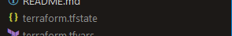

# Terraform Import & Config Drift
If you loose your state file you might not be able to recover your infrastructure. Depending on the number of resources it might be possible.

General rule is to store the state file in ie. Terraform Cloud.

https://developer.hashicorp.com/terraform/cli/import

https://developer.hashicorp.com/terraform/language/import

```json
import {
  to = aws_instance.example
  id = "i-abcd1234"
}

resource "aws_instance" "example" {
  name = "hashi"
  # (other resource arguments...)
}

```

# Steps to import

```sh
$ tf init

Initializing the backend...

Initializing provider plugins...
- Reusing previous version of hashicorp/random from the dependency lock file
- Reusing previous version of hashicorp/aws from the dependency lock file
- Installing hashicorp/random v3.5.1...
- Installed hashicorp/random v3.5.1 (signed by HashiCorp)
- Installing hashicorp/aws v5.17.0...
- Installed hashicorp/aws v5.17.0 (signed by HashiCorp)

Terraform has been successfully initialized!

You may now begin working with Terraform. Try running "terraform plan" to see
any changes that are required for your infrastructure. All Terraform commands
should now work.

If you ever set or change modules or backend configuration for Terraform,
rerun this command to reinitialize your working directory. If you forget, other
commands will detect it and remind you to do so if necessary.


$ terraform import aws_s3_bucket.example ___ID___
aws_s3_bucket.example: Importing from ID "___ID___"...
aws_s3_bucket.example: Import prepared!
  Prepared aws_s3_bucket for import
aws_s3_bucket.example: Refreshing state... [id=___ID___]

Import successful!

The resources that were imported are shown above. These resources are now in
your Terraform state and will henceforth be managed by Terraform.


# Looking at the state file it seems like the provider Random is not imported
# This forces a replacement of the bucket!

$ tf plan
aws_s3_bucket.example: Refreshing state... [id=___ID___]

Terraform used the selected providers to generate the following execution plan. Resource actions are indicated with the following symbols:
  + create
-/+ destroy and then create replacement

Terraform will perform the following actions:

  # aws_s3_bucket.example must be replaced
-/+ resource "aws_s3_bucket" "example" {
      + acceleration_status         = (known after apply)
      + acl                         = (known after apply)
      ~ arn                         = "arn:aws:s3:::___ID___" -> (known after apply)
      ~ bucket                      = "___ID___" # forces replacement -> (known after apply) # forces replacement
      ~ bucket_domain_name          = "___ID___.s3.amazonaws.com" -> (known after apply)
      + bucket_prefix               = (known after apply)
      ~ bucket_regional_domain_name = "___ID___.s3.eu-north-1.amazonaws.com" -> (known after apply)
      + force_destroy               = false
      ~ hosted_zone_id              = "Z3BAZG2TWCNX0D" -> (known after apply)
      ~ id                          = "___ID___" -> (known after apply)
      ~ object_lock_enabled         = false -> (known after apply)
      + policy                      = (known after apply)
      ~ region                      = "eu-north-1" -> (known after apply)
      ~ request_payer               = "BucketOwner" -> (known after apply)
        tags                        = {
            "UserUuid" = "___UUID___"
        }
      + website_domain              = (known after apply)
      + website_endpoint            = (known after apply)
        # (1 unchanged attribute hidden)

      - grant {
          - id          = "8ac82ade07cbd8c14a7f153fb920561ba3f19829b41d12ceb830fd26edc909e0" -> null
          - permissions = [
              - "FULL_CONTROL",
            ] -> null
          - type        = "CanonicalUser" -> null
        }

      - server_side_encryption_configuration {
          - rule {
              - bucket_key_enabled = false -> null

              - apply_server_side_encryption_by_default {
                  - sse_algorithm = "AES256" -> null
                }
            }
        }

      - versioning {
          - enabled    = false -> null
          - mfa_delete = false -> null
        }
    }

  # random_string.bucket_name will be created
  + resource "random_string" "bucket_name" {
      + id          = (known after apply)
      + length      = 32
      + lower       = true
      + min_lower   = 0
      + min_numeric = 0
      + min_special = 0
      + min_upper   = 0
      + number      = true
      + numeric     = true
      + result      = (known after apply)
      + special     = false
      + upper       = false
    }

Plan: 2 to add, 0 to change, 1 to destroy.

Changes to Outputs:
  + random_bucket_name = (known after apply)


# Import provider Random
$ terraform import random_string.bucket_name ___ID___
random_string.bucket_name: Importing from ID "___ID___"...
random_string.bucket_name: Import prepared!
  Prepared random_string for import
random_string.bucket_name: Refreshing state... [id=___ID___]

Import successful!

The resources that were imported are shown above. These resources are now in
your Terraform state and will henceforth be managed by Terraform.


# Check if everything is in the correct state, tf plan should not do anything.
# It still does want to replace the bucket and bucket name
$ tf plan
random_string.bucket_name: Refreshing state... [id=___ID___]
aws_s3_bucket.example: Refreshing state... [id=___ID___]

Terraform used the selected providers to generate the following execution plan. Resource actions are indicated with the following symbols:
-/+ destroy and then create replacement

Terraform will perform the following actions:

  # aws_s3_bucket.example must be replaced
-/+ resource "aws_s3_bucket" "example" {
      + acceleration_status         = (known after apply)
      + acl                         = (known after apply)
      ~ arn                         = "arn:aws:s3:::___ID___" -> (known after apply)
      ~ bucket                      = "___ID___" # forces replacement -> (known after apply) # forces replacement
      ~ bucket_domain_name          = "___ID___.s3.amazonaws.com" -> (known after apply)
      + bucket_prefix               = (known after apply)
      ~ bucket_regional_domain_name = "___ID___.s3.eu-north-1.amazonaws.com" -> (known after apply)
      + force_destroy               = false
      ~ hosted_zone_id              = "Z3BAZG2TWCNX0D" -> (known after apply)
      ~ id                          = "___ID___" -> (known after apply)
      ~ object_lock_enabled         = false -> (known after apply)
      + policy                      = (known after apply)
      ~ region                      = "eu-north-1" -> (known after apply)
      ~ request_payer               = "BucketOwner" -> (known after apply)
        tags                        = {
            "UserUuid" = "___UUID___"
        }
      + website_domain              = (known after apply)
      + website_endpoint            = (known after apply)
        # (1 unchanged attribute hidden)

      - grant {
          - id          = "8ac82ade07cbd8c14a7f153fb920561ba3f19829b41d12ceb830fd26edc909e0" -> null
          - permissions = [
              - "FULL_CONTROL",
            ] -> null
          - type        = "CanonicalUser" -> null
        }

      - server_side_encryption_configuration {
          - rule {
              - bucket_key_enabled = false -> null

              - apply_server_side_encryption_by_default {
                  - sse_algorithm = "AES256" -> null
                }
            }
        }

      - versioning {
          - enabled    = false -> null
          - mfa_delete = false -> null
        }
    }

  # random_string.bucket_name must be replaced
-/+ resource "random_string" "bucket_name" {
      ~ id          = "___ID___" -> (known after apply)
      ~ result      = "___ID___" -> (known after apply)
      ~ special     = true -> false # forces replacement
      ~ upper       = true -> false # forces replacement
        # (8 unchanged attributes hidden)
    }

Plan: 2 to add, 0 to change, 2 to destroy.

Changes to Outputs:
  ~ random_bucket_name = "___ID___" -> (known after apply)

──────────────────────────────────────────────────────────────────────────────────────────────────────────────────────────────────────────────────────────────────

Note: You didn't use the -out option to save this plan, so Terraform can't guarantee to take exactly these actions if you run "terraform apply" now.
```


## Random provider
Since we are using local state now and the state file is deleted each time Gitpod shuts down the provider Random can't be used.

Edit the following files, delete or comment
`providers.tf`
```json
  required_providers {
#    random = {
#      source = "hashicorp/random"
#      version = "3.5.1"
#    }

#provider "random" {
#  # Configuration options
#}
```

`main.tf`
```json


# https://registry.terraform.io/providers/hashicorp/random/latest/docs/resources/string
#resource "random_string" "bucket_name" {
#  lower            = true
#  upper            = false
#  length           = 32
#  special          = false
#}

# https://registry.terraform.io/providers/hashicorp/aws/latest/docs/resources/s3_bucket
resource "aws_s3_bucket" "example" {
  # Bucket naming rules
  # https://docs.aws.amazon.com/AmazonS3/latest/userguide/bucketnamingrules.html?icmpid=docs_amazons3_console
  bucket = var.bucket_name

   tags = {
   UserUuid = var.user_uuid
  }
}

```

`terraform.tfvars`
```json
bucket_name="___ID___"
```

`terraform.tfvars.example`
```sh
bucket_name="___ID___"
```

`variables.tf`
```json
variable "bucket_name" {
  description = "Name of the S3 bucket"
  type        = string

  validation {
    condition     = can(regex("^[a-z0-9.-]{3,63}$", var.bucket_name))
    error_message = "bucket_name must be between 3 and 63 characters long and can only contain lowercase letters, numbers, periods, and hyphens"
  }
}

```

`outputs.tf`
```json
output "random_bucket_name" {
  value = aws_s3_bucket.website_bucket.bucket
}
```


The `destroy` messages are OK since we changed the name of the bucket "example" to "website_bucket"
```sh
$ tf plan
random_string.bucket_name: Refreshing state... [id=___ID___]
aws_s3_bucket.example: Refreshing state... [id=___ID___]

Terraform used the selected providers to generate the following execution plan. Resource actions are indicated with the following symbols:
  + create
  - destroy

Terraform will perform the following actions:

  # aws_s3_bucket.example will be destroyed
  # (because aws_s3_bucket.example is not in configuration)
  - resource "aws_s3_bucket" "example" {
      - arn                         = "arn:aws:s3:::___ID___" -> null
      - bucket                      = "___ID___" -> null
      - bucket_domain_name          = "___ID___.s3.amazonaws.com" -> null
      - bucket_regional_domain_name = "___ID___.s3.eu-north-1.amazonaws.com" -> null
      - hosted_zone_id              = "Z3BAZG2TWCNX0D" -> null
      - id                          = "___ID___" -> null
      - object_lock_enabled         = false -> null
      - region                      = "eu-north-1" -> null
      - request_payer               = "BucketOwner" -> null
      - tags                        = {
          - "UserUuid" = "___UUID___"
        } -> null
      - tags_all                    = {
          - "UserUuid" = "___UUID___"
        } -> null

      - grant {
          - id          = "8ac82ade07cbd8c14a7f153fb920561ba3f19829b41d12ceb830fd26edc909e0" -> null
          - permissions = [
              - "FULL_CONTROL",
            ] -> null
          - type        = "CanonicalUser" -> null
        }

      - server_side_encryption_configuration {
          - rule {
              - bucket_key_enabled = false -> null

              - apply_server_side_encryption_by_default {
                  - sse_algorithm = "AES256" -> null
                }
            }
        }

      - versioning {
          - enabled    = false -> null
          - mfa_delete = false -> null
        }
    }

  # aws_s3_bucket.website_bucket will be created
  + resource "aws_s3_bucket" "website_bucket" {
      + acceleration_status         = (known after apply)
      + acl                         = (known after apply)
      + arn                         = (known after apply)
      + bucket                      = "___ID___"
      + bucket_domain_name          = (known after apply)
      + bucket_prefix               = (known after apply)
      + bucket_regional_domain_name = (known after apply)
      + force_destroy               = false
      + hosted_zone_id              = (known after apply)
      + id                          = (known after apply)
      + object_lock_enabled         = (known after apply)
      + policy                      = (known after apply)
      + region                      = (known after apply)
      + request_payer               = (known after apply)
      + tags                        = {
          + "UserUuid" = "___UUID___"
        }
      + tags_all                    = {
          + "UserUuid" = "___UUID___"
        }
      + website_domain              = (known after apply)
      + website_endpoint            = (known after apply)
    }

  # random_string.bucket_name will be destroyed
  # (because random_string.bucket_name is not in configuration)
  - resource "random_string" "bucket_name" {
      - id          = "___ID___" -> null
      - length      = 32 -> null
      - lower       = true -> null
      - min_lower   = 0 -> null
      - min_numeric = 0 -> null
      - min_special = 0 -> null
      - min_upper   = 0 -> null
      - number      = true -> null
      - numeric     = true -> null
      - result      = "___ID___" -> null
      - special     = true -> null
      - upper       = true -> null
    }

Plan: 1 to add, 0 to change, 2 to destroy.


```

Doing a `tf apply` gives one error when it tries to delete and create the bucket with the same name. It deletes the bucket but fails to create it (same name)

Run `tf apply` again and everything is OK.
```sh
tf apply --auto-approve

Terraform used the selected providers to generate the following execution plan. Resource actions are indicated with the following symbols:
  + create

Terraform will perform the following actions:

  # aws_s3_bucket.website_bucket will be created
  + resource "aws_s3_bucket" "website_bucket" {
      + acceleration_status         = (known after apply)
      + acl                         = (known after apply)
      + arn                         = (known after apply)
      + bucket                      = "___ID___"
      + bucket_domain_name          = (known after apply)
      + bucket_prefix               = (known after apply)
      + bucket_regional_domain_name = (known after apply)
      + force_destroy               = false
      + hosted_zone_id              = (known after apply)
      + id                          = (known after apply)
      + object_lock_enabled         = (known after apply)
      + policy                      = (known after apply)
      + region                      = (known after apply)
      + request_payer               = (known after apply)
      + tags                        = {
          + "UserUuid" = "___UUID___"
        }
      + tags_all                    = {
          + "UserUuid" = "___UUID___"
        }
      + website_domain              = (known after apply)
      + website_endpoint            = (known after apply)
    }

Plan: 1 to add, 0 to change, 0 to destroy.
aws_s3_bucket.website_bucket: Creating...
aws_s3_bucket.website_bucket: Creation complete after 2s [id=___ID___]

Apply complete! Resources: 1 added, 0 changed, 0 destroyed.

Outputs:

random_bucket_name = "___ID___"
```


# Git
```sh
$ git add .
$ git fetch
From https://github.com/kjejac/terraform-beginner-bootcamp-2023
 * [new branch]      24-configuration-drift -> origin/24-configuration-drift
$ git checkout 24-configuration-drift
M       journal/week1.md
M       main.tf
M       outputs.tf
M       providers.tf
M       terraform.tfvars.example
M       variables.tf
branch '24-configuration-drift' set up to track 'origin/24-configuration-drift'.
Switched to a new branch '24-configuration-drift'

$ git checkout main
Switched to branch 'main'
Your branch is up to date with 'origin/main'.

$ git pull
remote: Enumerating objects: 1, done.
remote: Counting objects: 100% (1/1), done.
remote: Total 1 (delta 0), reused 0 (delta 0), pack-reused 0
Unpacking objects: 100% (1/1), 592 bytes | 592.00 KiB/s, done.
From https://github.com/kjejac/terraform-beginner-bootcamp-2023
   1e7aeb5..79e1145  main       -> origin/main
Updating 1e7aeb5..79e1145
Fast-forward
 journal/week1.md         | 26 +++++++++++++++++++++++---
 main.tf                  | 16 ++++++++--------
 outputs.tf               |  2 +-
 providers.tf             | 14 +++++++-------
 terraform.tfvars.example |  3 ++-
 variables.tf             | 10 ++++++++++
 6 files changed, 51 insertions(+), 20 deletions(-)

$ git tag 1.2.0

$ git push; git push --tags
Everything up-to-date
Total 0 (delta 0), reused 0 (delta 0), pack-reused 0
To https://github.com/kjejac/terraform-beginner-bootcamp-2023.git
 * [new tag]         1.2.0 -> 1.2.0
```