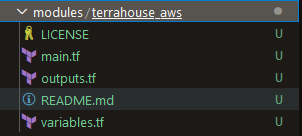
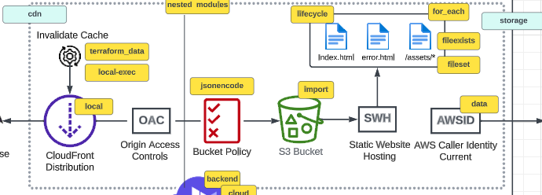

# Creating Terraform Module
Create Issue
`# AWS Terrahous Module #26`
- [ ] Setup directory structure for our module
- [ ] Port our S3 bucket into the module

[Terraform Module Overview](https://developer.hashicorp.com/terraform/language/modules)

[Structure of a module](https://developer.hashicorp.com/terraform/language/modules/develop/structure)
```sh

$ tree complete-module/
.
├── README.md
├── main.tf
├── variables.tf
├── outputs.tf
├── ...
├── modules/
│   ├── nestedA/
│   │   ├── README.md
│   │   ├── variables.tf
│   │   ├── main.tf
│   │   ├── outputs.tf
│   ├── nestedB/
│   ├── .../
├── examples/
│   ├── exampleA/
│   │   ├── main.tf
│   ├── exampleB/
│   ├── .../
```

Create the following



Separate into two files; Storage and Delivery


_When working with modules you have to provide the providers in the module or it will throw an error._

Move content from the files in the root directory to the `terrahouse_aws` modules files.
Main difference here is that everything in `providers.tf` was moved to `main.tf`.

To import the module insert in `main.tf` (root). [The module source is documented here](https://developer.hashicorp.com/terraform/language/modules/sources)
```hcl
terraform {
#  cloud {
#    organization = "kjejac"
#    workspaces {
#      name = "terra-house-1"
#    }
#  }
}

module "terrahouse_aws" {
  source = "./modules/terrahouse_aws"
}
```

Running `terraform init` to verify if everything works after moving to a module
```sh
$ terraform init

Initializing the backend...
Initializing modules...
- terrahouse_aws in modules/terrahouse_aws

Initializing provider plugins...
- Reusing previous version of hashicorp/aws from the dependency lock file
- Installing hashicorp/aws v5.17.0...
- Installed hashicorp/aws v5.17.0 (signed by HashiCorp)

Terraform has made some changes to the provider dependency selections recorded
in the .terraform.lock.hcl file. Review those changes and commit them to your
version control system if they represent changes you intended to make.

╷
│ Warning: Redundant empty provider block
│
│   on modules/terrahouse_aws/main.tf line 11:
│   11: provider "aws" {
│
│ Earlier versions of Terraform used empty provider blocks ("proxy provider configurations") for child modules to declare their need to be passed a provider
│ configuration by their callers. That approach was ambiguous and is now deprecated.
│
│ If you control this module, you can migrate to the new declaration syntax by removing all of the empty provider "aws" blocks and then adding or updating an
│ entry like the following to the required_providers block of module.terrahouse_aws:
│     aws = {
│       source = "hashicorp/aws"
│     }
│
│ (and one more similar warning elsewhere)
╵

Terraform has been successfully initialized!

You may now begin working with Terraform. Try running "terraform plan" to see
any changes that are required for your infrastructure. All Terraform commands
should now work.

If you ever set or change modules or backend configuration for Terraform,
rerun this command to reinitialize your working directory. If you forget, other
commands will detect it and remind you to do so if necessary.
```

There seems to be no need for
```tf
provider "aws" {
  # Configuration options
  # region     = "us-west-2"
  # access_key = "my-access-key"
  # secret_key = "my-secret-key"
}
```
in `main.tf`

Running `terraform init` again gives no warnings
```sh
$ terraform init

Initializing the backend...
Initializing modules...

Initializing provider plugins...
- Reusing previous version of hashicorp/aws from the dependency lock file
- Using previously-installed hashicorp/aws v5.17.0

Terraform has been successfully initialized!

You may now begin working with Terraform. Try running "terraform plan" to see
any changes that are required for your infrastructure. All Terraform commands
should now work.

If you ever set or change modules or backend configuration for Terraform,
rerun this command to reinitialize your working directory. If you forget, other
commands will detect it and remind you to do so if necessary.
```

Running `terraform plan` to see if it works
```sh
$ terraform plan
╷
│ Warning: Value for undeclared variable
│
│ The root module does not declare a variable named "user_uuid" but a value was found in file "terraform.tfvars". If you meant to use this value, add a "variable"
│ block to the configuration.
│
│ To silence these warnings, use TF_VAR_... environment variables to provide certain "global" settings to all configurations in your organization. To reduce the
│ verbosity of these warnings, use the -compact-warnings option.
╵
╷
│ Warning: Value for undeclared variable
│
│ The root module does not declare a variable named "bucket_name" but a value was found in file "terraform.tfvars". If you meant to use this value, add a
│ "variable" block to the configuration.
│
│ To silence these warnings, use TF_VAR_... environment variables to provide certain "global" settings to all configurations in your organization. To reduce the
│ verbosity of these warnings, use the -compact-warnings option.
╵
╷
│ Error: Unsupported argument
│
│   on main.tf line 13, in module "terrahouse_aws":
│   13:   user_uuid = var.user_uuid
│
│ An argument named "user_uuid" is not expected here.
╵
╷
│ Error: Unsupported argument
│
│   on main.tf line 14, in module "terrahouse_aws":
│   14:   bucket_name = var.bucket_name
│
│ An argument named "bucket_name" is not expected here.
╵
```

This is caused by that there are no variables in top level `variables.tf`. Modified the file
```tf
variable "user_uuid" {
    type = string
}

variable "bucket_name" {
  type        = string
}
```

Running `terraform plan again`
```sh
$ terraform plan

Terraform used the selected providers to generate the following execution plan. Resource actions are indicated with the following symbols:
  + create

Terraform will perform the following actions:

  # module.terrahouse_aws.aws_s3_bucket.website_bucket will be created
  + resource "aws_s3_bucket" "website_bucket" {
      + acceleration_status         = (known after apply)
      + acl                         = (known after apply)
      + arn                         = (known after apply)
      + bucket                      = "zs1o9v2k9un1ksepm2eup740kzo6pc9n"
      + bucket_domain_name          = (known after apply)
      + bucket_prefix               = (known after apply)
      + bucket_regional_domain_name = (known after apply)
      + force_destroy               = false
      + hosted_zone_id              = (known after apply)
      + id                          = (known after apply)
      + object_lock_enabled         = (known after apply)
      + policy                      = (known after apply)
      + region                      = (known after apply)
      + request_payer               = (known after apply)
      + tags                        = {
          + "UserUuid" = "____UUID____"
        }
      + tags_all                    = {
          + "UserUuid" = "____UUID____"
        }
      + website_domain              = (known after apply)
      + website_endpoint            = (known after apply)
    }

Plan: 1 to add, 0 to change, 0 to destroy.

──────────────────────────────────────────────────────────────────────────────────────────────────────────────────────────────────────────────────────────────────

Note: You didn't use the -out option to save this plan, so Terraform can't guarantee to take exactly these actions if you run "terraform apply" now.
```

Create a new bucket by running `terraform apply`
```sh
$ terraform apply

Terraform used the selected providers to generate the following execution plan. Resource actions are indicated with the following symbols:
  + create

Terraform will perform the following actions:

  # module.terrahouse_aws.aws_s3_bucket.website_bucket will be created
  + resource "aws_s3_bucket" "website_bucket" {
      + acceleration_status         = (known after apply)
      + acl                         = (known after apply)
      + arn                         = (known after apply)
      + bucket                      = "zs1o9v2k9un1ksepm2eup740kzo6pc9n"
      + bucket_domain_name          = (known after apply)
      + bucket_prefix               = (known after apply)
      + bucket_regional_domain_name = (known after apply)
      + force_destroy               = false
      + hosted_zone_id              = (known after apply)
      + id                          = (known after apply)
      + object_lock_enabled         = (known after apply)
      + policy                      = (known after apply)
      + region                      = (known after apply)
      + request_payer               = (known after apply)
      + tags                        = {
          + "UserUuid" = "____UUID____"
        }
      + tags_all                    = {
          + "UserUuid" = "____UUID____"
        }
      + website_domain              = (known after apply)
      + website_endpoint            = (known after apply)
    }

Plan: 1 to add, 0 to change, 0 to destroy.

Do you want to perform these actions?
  Terraform will perform the actions described above.
  Only 'yes' will be accepted to approve.

  Enter a value: yes

module.terrahouse_aws.aws_s3_bucket.website_bucket: Creating...
module.terrahouse_aws.aws_s3_bucket.website_bucket: Creation complete after 3s [id=zs1o9v2k9un1ksepm2eup740kzo6pc9n]

Apply complete! Resources: 1 added, 0 changed, 0 destroyed.
```

This created the bucket, but no output. Running `terraform output`
```sh
$ terraform output
╷
│ Warning: No outputs found
│
│ The state file either has no outputs defined, or all the defined outputs are empty. Please define an output in your configuration with the `output` keyword and
│ run `terraform refresh` for it to become available. If you are using interpolation, please verify the interpolated value is not empty. You can use the
│ `terraform console` command to assist.
```
indicates that we have an error.

Since this is a nested module we need to reference it from the top level (`outputs.tf`)
```tf
output "bucket_name" {
    description = "Bucket name for our static website bucket"
    value = module.terrahouse_aws.random_bucket_name
}
```

Running `terraform plan` again shows now that `outputs` are now included
```sh
$ tf plan
module.terrahouse_aws.aws_s3_bucket.website_bucket: Refreshing state... [id=zs1o9v2k9un1ksepm2eup740kzo6pc9n]

Changes to Outputs:
  + bucket_name = "zs1o9v2k9un1ksepm2eup740kzo6pc9n"

You can apply this plan to save these new output values to the Terraform state, without changing any real infrastructure.
```

Deploying again should now include `outputs`
```sh
tf apply --auto-approve
module.terrahouse_aws.aws_s3_bucket.website_bucket: Refreshing state... [id=zs1o9v2k9un1ksepm2eup740kzo6pc9n]

Changes to Outputs:
  + bucket_name = "zs1o9v2k9un1ksepm2eup740kzo6pc9n"

You can apply this plan to save these new output values to the Terraform state, without changing any real infrastructure.

Apply complete! Resources: 0 added, 0 changed, 0 destroyed.

Outputs:

bucket_name = "zs1o9v2k9un1ksepm2eup740kzo6pc9n"
```

Running `terraform output`
```sh
tf output
bucket_name = "zs1o9v2k9un1ksepm2eup740kzo6pc9n"
```

Tear down the infrastructure since we are not using Terraform Cloud
```sh
$ tf destroy --auto-approve
module.terrahouse_aws.aws_s3_bucket.website_bucket: Refreshing state... [id=zs1o9v2k9un1ksepm2eup740kzo6pc9n]

Terraform used the selected providers to generate the following execution plan. Resource actions are indicated with the following symbols:
  - destroy

Terraform will perform the following actions:

  # module.terrahouse_aws.aws_s3_bucket.website_bucket will be destroyed
  - resource "aws_s3_bucket" "website_bucket" {
      - arn                         = "arn:aws:s3:::zs1o9v2k9un1ksepm2eup740kzo6pc9n" -> null
      - bucket                      = "zs1o9v2k9un1ksepm2eup740kzo6pc9n" -> null
      - bucket_domain_name          = "zs1o9v2k9un1ksepm2eup740kzo6pc9n.s3.amazonaws.com" -> null
      - bucket_regional_domain_name = "zs1o9v2k9un1ksepm2eup740kzo6pc9n.s3.eu-north-1.amazonaws.com" -> null
      - force_destroy               = false -> null
      - hosted_zone_id              = "Z3BAZG2TWCNX0D" -> null
      - id                          = "zs1o9v2k9un1ksepm2eup740kzo6pc9n" -> null
      - object_lock_enabled         = false -> null
      - region                      = "eu-north-1" -> null
      - request_payer               = "BucketOwner" -> null
      - tags                        = {
          - "UserUuid" = "____UUID____"
        } -> null
      - tags_all                    = {
          - "UserUuid" = "____UUID____"
        } -> null

      - grant {
          - id          = "8ac82ade07cbd8c14a7f153fb920561ba3f19829b41d12ceb830fd26edc909e0" -> null
          - permissions = [
              - "FULL_CONTROL",
            ] -> null
          - type        = "CanonicalUser" -> null
        }

      - server_side_encryption_configuration {
          - rule {
              - bucket_key_enabled = false -> null

              - apply_server_side_encryption_by_default {
                  - sse_algorithm = "AES256" -> null
                }
            }
        }

      - versioning {
          - enabled    = false -> null
          - mfa_delete = false -> null
        }
    }

Plan: 0 to add, 0 to change, 1 to destroy.

Changes to Outputs:
  - bucket_name = "zs1o9v2k9un1ksepm2eup740kzo6pc9n" -> null
module.terrahouse_aws.aws_s3_bucket.website_bucket: Destroying... [id=zs1o9v2k9un1ksepm2eup740kzo6pc9n]
module.terrahouse_aws.aws_s3_bucket.website_bucket: Destruction complete after 1s

Destroy complete! Resources: 1 destroyed.
```
# Git
```sh
# add all changed files
git add .

# Comment and commit
git commit -m "#26 refactor s3 bucket into the new terrahouse_aws module"

# Upload the changes to Github
git push

# After pull request and squash and merge
$ git checkout main
Switched to branch 'main'
Your branch is up to date with 'origin/main'.

# Retrive latest from Github
git pull
remote: Enumerating objects: 21, done.
remote: Counting objects: 100% (21/21), done.
remote: Compressing objects: 100% (8/8), done.
remote: Total 14 (delta 4), reused 13 (delta 4), pack-reused 0
Unpacking objects: 100% (14/14), 6.04 KiB | 3.02 MiB/s, done.
From https://github.com/kjejac/terraform-beginner-bootcamp-2023
   79e1145..8d4e49e  main       -> origin/main
Updating 79e1145..8d4e49e
Fast-forward
 .terraform.lock.hcl                 |  20 --------------
 journal/week1.md                    |  46 +++++++++++++++++++++++++++++--
 main.tf                             |  33 ++++++++++-------------
 modules/terrahouse_aws/LICENSE      | 176 +++++++++++++++++++++++++++++++++++++++++++++++++++++++++++++++++++++++++++++++++++++++++++++++++++++++++++++++++++++++
 modules/terrahouse_aws/README.md    |   0
 modules/terrahouse_aws/main.tf      |  20 ++++++++++++++
 modules/terrahouse_aws/outputs.tf   |   3 +++
 modules/terrahouse_aws/variables.tf |  18 +++++++++++++
 outputs.tf                          |   5 ++--
 providers.tf                        |  26 ------------------
 variables.tf                        |  13 +--------
 11 files changed, 279 insertions(+), 81 deletions(-)
 create mode 100644 modules/terrahouse_aws/LICENSE
 create mode 100644 modules/terrahouse_aws/README.md
 create mode 100644 modules/terrahouse_aws/main.tf
 create mode 100644 modules/terrahouse_aws/outputs.tf
 create mode 100644 modules/terrahouse_aws/variables.tf
 delete mode 100644 providers.tf

# Create the tag
git tag 1.3.0

# Push tag to Github
$ git push --tags
Total 0 (delta 0), reused 0 (delta 0), pack-reused 0
To https://github.com/kjejac/terraform-beginner-bootcamp-2023.git
 * [new tag]         1.3.0 -> 1.3.0
```