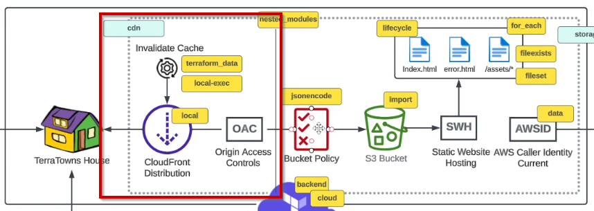

# CDN



[Amazon CloudFront introduces Origin Access Control (OAC)](https://aws.amazon.com/blogs/networking-and-content-delivery/amazon-cloudfront-introduces-origin-access-control-oac/)

ChatGPT does not have the latest providers for configuring CloudFront


Create issue `CDN Implementation`
- [ ] CloudFront distribution
- [ ] CloudFront Origin Access Control
- [ ] Bucket Policy

[Resource: aws_cloudfront_distribution](https://registry.terraform.io/providers/hashicorp/aws/latest/docs/resources/cloudfront_distribution)

# Gitpod

## Create a new file `resource-cdn.tf` & `resource-storage.tf` in the module

New files created to keep length of `main.tf` down.

```sh
touch resource-cdn.tf resource-storage.tf
```

[Resource: aws_cloudfront_origin_access_control](https://registry.terraform.io/providers/hashicorp/aws/latest/docs/resources/cloudfront_origin_access_control)

[Resource: aws_s3_bucket_policy](https://registry.terraform.io/providers/hashicorp/aws/latest/docs/resources/s3_bucket_policy)

