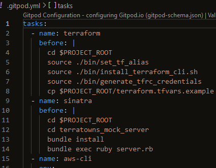

# Mock Web Server

Imbed the code from repo [Terratowns_mock_server](https://github.com/examproco/terratowns_mock_server)

Create new issue `Terratowns mock server`
- [ ] Download Terratowns mock server into our repo
https://github.com/examproco/terratowns_mock_server

To just copy the code from the repo without making it a sub repo do the following
```sh
git clone https://github.com/ExamProCo/terratowns_mock_server.git
Cloning into 'terratowns_mock_server'...
remote: Enumerating objects: 20, done.
remote: Counting objects: 100% (20/20), done.
remote: Compressing objects: 100% (14/14), done.
remote: Total 20 (delta 7), reused 15 (delta 6), pack-reused 0
Receiving objects: 100% (20/20), 9.34 KiB | 9.34 MiB/s, done.
Resolving deltas: 100% (7/7), done.

cd terratowns_mock_server/
ls -la
total 44
drwxr-xr-x 4 gitpod gitpod   150 Oct  1 18:30 .
drwxr-xr-x 8 gitpod gitpod  4096 Oct  1 18:30 ..
drwxr-xr-x 2 gitpod gitpod    60 Oct  1 18:30 bin
-rw-r--r-- 1 gitpod gitpod   126 Oct  1 18:30 Gemfile
-rw-r--r-- 1 gitpod gitpod  1069 Oct  1 18:30 Gemfile.lock
drwxr-xr-x 8 gitpod gitpod   163 Oct  1 18:30 .git
-rw-r--r-- 1 gitpod gitpod  1205 Oct  1 18:30 .gitignore
-rw-r--r-- 1 gitpod gitpod    92 Oct  1 18:30 .gitpod.yml
-rw-r--r-- 1 gitpod gitpod 11357 Oct  1 18:30 LICENSE
-rw-r--r-- 1 gitpod gitpod    76 Oct  1 18:30 README.md
-rw-r--r-- 1 gitpod gitpod  4926 Oct  1 18:30 server.rb

rm -rf .git

ls -la
total 44
drwxr-xr-x 3 gitpod gitpod   138 Oct  1 18:33 .
drwxr-xr-x 8 gitpod gitpod  4096 Oct  1 18:30 ..
drwxr-xr-x 2 gitpod gitpod    60 Oct  1 18:30 bin
-rw-r--r-- 1 gitpod gitpod   126 Oct  1 18:30 Gemfile
-rw-r--r-- 1 gitpod gitpod  1069 Oct  1 18:30 Gemfile.lock
-rw-r--r-- 1 gitpod gitpod  1205 Oct  1 18:30 .gitignore
-rw-r--r-- 1 gitpod gitpod    92 Oct  1 18:30 .gitpod.yml
-rw-r--r-- 1 gitpod gitpod 11357 Oct  1 18:30 LICENSE
-rw-r--r-- 1 gitpod gitpod    76 Oct  1 18:30 README.md
-rw-r--r-- 1 gitpod gitpod  4926 Oct  1 18:30 server.rb
```

Cut the content from `.gitpod.yml` and paste it to the `.gitpod.yml` file in the root directory.
```yml
tasks:
  - name: sinatra
  - cd terratowns_mock_server
    before: |
      bundle install
      bundle exec ruby server.rb
```

Remove the empty `.gitpod.yml` file
```sh
rm -rf .gitpod.yml
```

Rename the `/terratowns_mock_server/bin` directory to `/terratowns_mock_server/terratowns`
```sh
mv bin terratowns
```

Move the `terratowns` directory to `/bin/`
```sh
mv terratowns $PROJECT_ROOT/bin/
```

Set permission on the files
```sh
chmod u+x $PROJECT_ROOT/bin/terratowns/*
```

Commit changes
Some problems... `git add .` did not add all files - had to do a second commit to get `.gitpod.yml` and `terratowns`.


### Sinatra web server
A web framework for building webapps.
It's light weight and easy to mock it.
[Sinatra ](https://sinatrarb.com/)



`bundle` is the way to bring packages into ruby
`gems` file for modules to be installed

