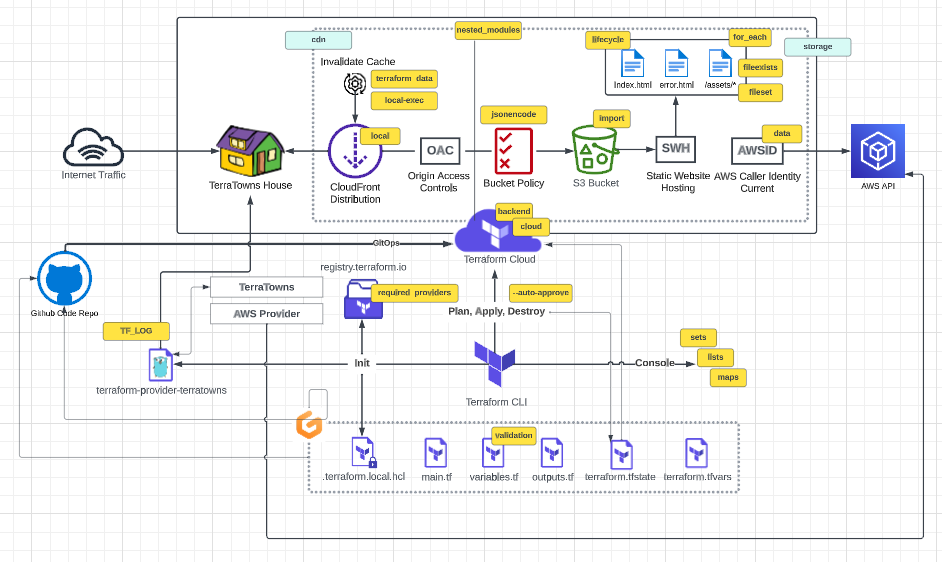
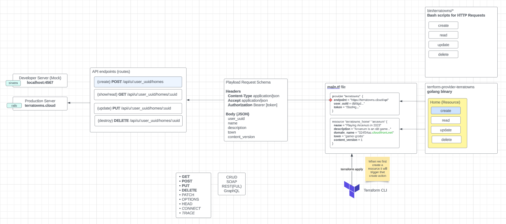
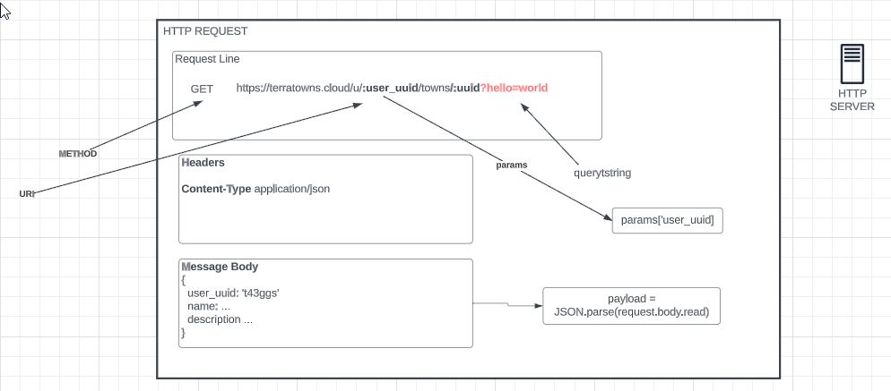

# Terraform Beginner Bootcamp 2023 - Week 2



- [Terraform Beginner Bootcamp 2023 - Week 2](#terraform-beginner-bootcamp-2023---week-2)
  - [Working with Ruby](#working-with-ruby)
    - [Bundler](#bundler)
      - [Install Gems](#install-gems)
      - [Executing Ruby scripts in the context of bundler](#executing-ruby-scripts-in-the-context-of-bundler)
    - [Sinatra](#sinatra)
  - [Terratowns Mock Web Server](#terratowns-mock-web-server)
    - [Running the web server](#running-the-web-server)
  - [CRUD](#crud)
  - [Terrahouse AWS](#terrahouse-aws)
  - [Root Module Structure after project completion](#root-module-structure-after-project-completion)

## Working with Ruby

### Bundler

Bundler is a package manager for Ruby.
It is the primary way to install Ruby packages (known as gmes) for Ruby.

#### Install Gems

You need to create a Gemfile and define your gmes in that file.

```rb
source "https://rubygems.org"

gem 'sinatra'
gem 'rake'
gem 'pry'
gem 'puma'
gem 'activerecord'
```

Then you need to run the `bundle install` command.

This will install the gem on the system globally (unlike nodejs which install packages in place in a directory called node_modules).

A Gemfile.lock will be created to lock down the gem versions used in this project.

#### Executing Ruby scripts in the context of bundler

We have to use `bundle exec` to tell future Ruby scripts to use gems we installed. This is the way we set context.

### Sinatra

Sinatra is a micro web-framework for Ruby to build web-apps.

Its great for mock or developments servers or for very simple projects.

You can create a web-server in a single file.

[Sinatra](https://sinatrarb.com/)

## Terratowns Mock Web Server

### Running the web server

We can run the web server by executing the following commands:

```rb
bundle install
bundle exec ruby server.rb
```

All of the code for our server is stored in the `server.rb` file.

## CRUD

Terraform Provider resources utilize CRUD.

CRUD stands for Create, Read, Update, and Delete.

CRUD in the project are bashscripts for the mock server, and the custom provider in Go lang.



[CRUD Wikipeida](https://en.wikipedia.org/wiki/Create,_read,_update_and_delete)

Anatomy of the HTTP request


## Terrahouse AWS

```tf
# House 1
module "home_nature" {
  source = "./modules/terrahome_aws"
  # env vars
  user_uuid = var.teacherseat_user_uuid
  public_path = var.nature_public_path
  content_version = var.content_version
}
```

The public directory expects the following:
- index.html
- error.html
- assets/

All top level files in assets will be copied, but not any subdirectories.

## Root Module Structure after project completion

```
- PROJECT_ROOT
    ├── .gitignore                      - Files that should not be synced to repo
    ├── .gitpod.yml                     - Config for Gitpod when it starts
    ├── LICENSE                         - Usage terms
    ├── main.tf                         - State of the project
    ├── outputs.tf                      - The outputs that we want in the terminal
    ├── README.md                       - Index for the documentation
    ├── terraform.tfvars.example        - Env var examples, copied to terraform.tfvars when gitpod starts
    ├── terraformrc                     - Config file used to set config for a user or a specfic project
    ├── variables.tf                    - Variables for the project, in this case calls on the module var file and others
    ├── bin                             - Contains bash scripts
    │   ├── build_provider
    │   ├── ..
    │   └── terratowns                  - CRUD local scripts
    │       ├── create
    │       ├── ..
    ├── journal                         - Contains documentation for the project in Markdown format
    │   ├── assets                      - Contains media like pictures
    │   │   ├── git.png
    │   │   └── ..
    │   ├── week0.md
    │   └── ..
    ├── modules                         - Module created for the project
    │   └── terrahome_aws
    │       ├── LICENSE
    │       ├── main.tf                 - Need the providers
    │       ├── outputs.tf
    │       ├── README.md
    │       ├── resource-cdn.tf         - Contains all the resources for CDN
    │       ├── resource-storage.tf     - Contains all the resources for storage
    │       └── variables.tf            - Variables
    ├── public                          - Contains the Terratowns homes
    │   ├── food
    │   │   ├── assets
    │   │   │   ├── ..
    │   │   ├── error.html
    │   │   └── index.html
    │   └── nature
    │       ├── ..
    ├── terraform-provider-terratowns   - Custom provider for CRUD, written i Go
    │   ├── go.mod                      - Contains metadata about the module, its dependencies, and version constraints. Crucial for maintaining reproducibility and stability in Go projects.
    │   ├── go.sum                      - Ensures the security, integrity, and reproducibility of Go projects by recording and verifying the cryptographic checksums of module dependencies.
    │   └── main.go                     - Contains the entry point of a Go program
    └── terratowns_mock_server          - Local test server
        ├── .gitignore
        ├── Gemfile
        ├── Gemfile.lock
        ├── LICENSE
        └── README.md
```